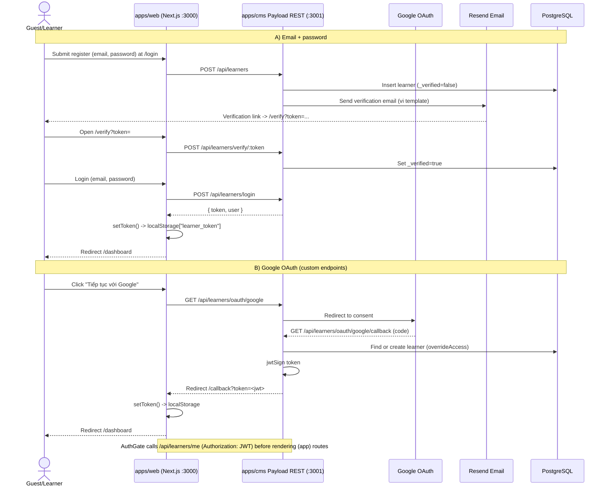
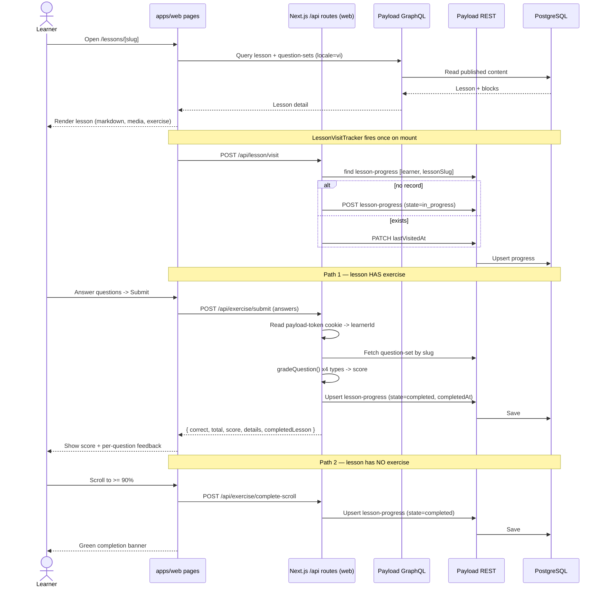
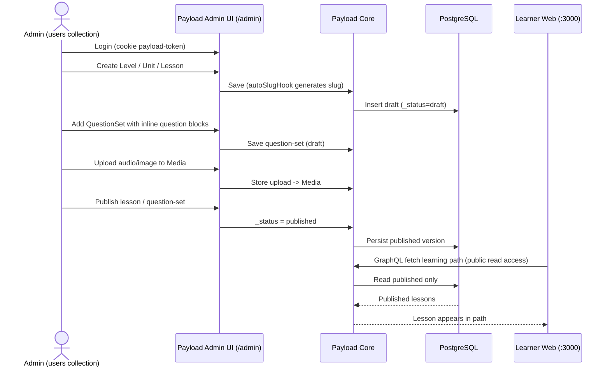

# Francais.vn Diagram Set

This file documents the **actual implemented architecture** of `francaisvn` (the pnpm monorepo with `apps/web` + `apps/cms`). It uses Markdown-native text diagrams for every diagram except the sequence diagrams, which remain Mermaid.

> Reality check vs. earlier drafts: the platform does **not** use Supabase, Strapi, PostHog, Sentry, Vercel, or a guest-trial flow. It is a **pnpm monorepo** of two Next.js apps — `apps/web` (learner frontend, port 3000) and `apps/cms` (Payload CMS admin + REST/GraphQL API, port 3001) — backed by **PostgreSQL 16 (Docker)**, with **Payload native auth**, **Google OAuth (custom endpoints)** and **Resend** email verification.

---

## 0. Tech & Module Map (quick reference)

```text
francaisvn/  (pnpm workspaces)
├── apps/web   @francaisvn/web   Next.js 16 (App Router), React 19.2, Tailwind v4, shadcn/ui   :3000
├── apps/cms   @francaisvn/cms   Payload CMS 3.8x (runs on Next.js) + Postgres adapter         :3001
└── docker-compose.yml           PostgreSQL 16 (Alpine)  db=francaisvn_cms                     :5432

Web → CMS communication:
  - GraphQL   src/lib/graphql.ts        (content reads: levels/units/lessons/question-sets)
  - REST      src/lib/auth.ts           (learner auth: /api/learners/*)
  - Next API  src/app/api/*             (server-side grading + progress writes -> CMS REST)

External services actually used:  Google OAuth 2.0  •  Resend (email verification)
```

### 0.1 Overall Architecture

A 4-tier view. Each box is a **functional component** (what it does), not a source file.
Numbered arrows are explained in the *Data Flows* table below the diagram.

```text
                ┌───────────┐   ┌───────────┐   ┌───────────────┐
   TIER 1       │   Guest   │   │  Learner  │   │ Admin/Founder │
   Actors       └─────┬─────┘   └─────┬─────┘   └───────┬───────┘
                      │ browse        │ learn           │ author content
                      ▼               ▼                 ▼
   ════════════════════════════════════════════════════════════════════════════

   TIER 2       ┌──────────────────────────────────┐   ┌────────────────────────┐
   Presentation │        Learner Web App           │   │     Admin Console      │
   (Browser)    │  ─────────────────────────────── │   │  ────────────────────  │
                │  Landing · Auth screens          │   │  Content editor        │
                │  Dashboard · Learning Path       │   │  (lessons, units,      │
                │  Lesson Reader + Exercises       │   │   question sets, media,│
                │  Vocabulary / Notes / Practice * │   │   vocabulary)          │
                │  ─────────────────────────────── │   │  Draft → Publish       │
                │  Session held as JWT (browser)   │   │  Session held as cookie│
                └───────────────┬──────────────────┘   └───────────┬────────────┘
                                │                                   │
                       (1) read content                            │ (6) manage
                       (2) sign in / up                            │     content
                       (3) save progress                           │
                                ▼                                   ▼
   ════════════════════════════════════════════════════════════════════════════

   TIER 3       ┌──────────────────────────────────┐   ┌────────────────────────┐
   Application  │   Web App Server (frontend BFF)  │   │   Content & Identity   │
   (Services)   │  ─────────────────────────────── │   │   Backend (Payload)    │
                │  • Auth Guard (gate app pages)   │   │  ────────────────────  │
                │  • Exercise Grading Service      │   │  • Content API         │
                │  • Lesson Visit / Completion     │   │    (read: GraphQL,     │
                │    Tracking                      │──▶│     write: REST)       │
                │                                  │(4)│  • Auth Service         │
                │  (renders pages, calls backend   │   │    (learners + admins) │
                │   on the user's behalf)          │   │  • Business Rules:     │
                └──────────────────────────────────┘   │    access control,     │
                                                        │    drafts/publish,     │
                ┌──────────────────────────────────┐   │    auto-slug, email    │
                │  External Identity & Mail         │◀──│    verify, i18n vi/fr/en│
                │  • Google OAuth 2.0 (sign-in)     │(7)│                        │
                │  • Resend (verification email)    │   └───────────┬────────────┘
                └──────────────────────────────────┘               │ (5) persist
   ════════════════════════════════════════════════════════════════│═════════════
                                                                    ▼
   TIER 4       ┌─────────────────────────────────────────────────────────────┐
   Data         │                    PostgreSQL 16 (Docker)                    │
                │  ─────────────────────────────────────────────────────────  │
                │  Identity:  admins · learners                                │
                │  Content :  levels · units · lessons · question sets ·       │
                │             vocabulary · media (uploaded files)              │
                │  Runtime :  lesson progress · question-set attempts          │
                └─────────────────────────────────────────────────────────────┘

   Legend:  * Vocabulary/Notes/Practice screens exist but still run on mock
             data / browser storage (not yet wired to the backend).
```

**Data Flows**

| # | From → To | Purpose | How |
|---|-----------|---------|-----|
| 1 | Web App → Content Backend | Load published courses (levels → units → lessons → question sets) | GraphQL read, public access |
| 2 | Web App → Auth Service | Register, verify email, log in (email/password or Google) | REST (`/api/learners/*`) |
| 3 | Web App → Web App Server | Submit exercise answers, mark lesson visited/completed | Internal API calls |
| 4 | Web App Server → Content Backend | Grade answers & write learner progress on the user's behalf | REST with learner's JWT |
| 5 | Content Backend → PostgreSQL | Read/write all content, identity & runtime data | Postgres adapter |
| 6 | Admin Console → Content Backend | Create/edit/publish lessons, question sets, media, vocabulary | Payload admin panel |
| 7 | Content Backend → Google / Resend | Federated sign-in & sending verification emails | OAuth 2.0 / Resend API |

**Key architectural ideas**

1. **One monorepo, two runnable apps.** The *Learner Web App* (frontend + its own server-side helper layer) and the *Content & Identity Backend* (Payload — admin panel + API) are separate deployables sharing one repository.
2. **The backend is the single data hub.** There is no separate content store vs. user store and no hand-written data layer — every read and write funnels through the backend into **one PostgreSQL database**.
3. **Two independent identities.** *Admins* sign in to the authoring console; *learners* sign in to the web app. Their sessions never collide (cookie vs. token), so the two audiences stay fully separated.
4. **Reads vs. writes are split.** Learners *read* published course content directly; anything that *changes state* (progress, grading) goes through the web app's server layer so grading and authorization happen server-side, not in the browser.
5. **Some screens are still front-end-only.** Vocabulary SRS and goals live in browser storage; Notes/Practice/Dictation/Shadowing use mock data; Chat and AI Mode are placeholders — all marked so the diagram reflects *what is actually wired*, not the wishlist.

---

## 1. System Modeling

### 1.1 Context Model

```text
Actors:
  Guest User      (public landing page only)
  Learner         ("learners" auth collection)
  Admin / Founder ("users" auth collection -> Payload admin panel)

                +-------------------------------------------------------+
                |                 Francais.vn Platform                  |
                |-------------------------------------------------------|
 Guest -------->|  apps/web  : Next.js learner frontend        (:3000)  |
 Learner ------>|            - GraphQL reads, REST auth, /api routes    |
                |                          |                            |
 Admin -------->|  apps/cms  : Payload CMS admin + API          (:3001) |
                |            - /admin, /api (REST), /graphql            |
                +----------------------------+--------------------------+
                                             |
                  +--------------------------+--------------------------+
                  |                          |                          |
                  v                          v                          v
        +-------------------+      +-------------------+      +-------------------+
        | PostgreSQL 16     |      | Google OAuth 2.0  |      | Resend (Email)    |
        | (Docker)          |      | learner sign-in   |      | verification mail |
        | francaisvn_cms    |      +-------------------+      +-------------------+
        +-------------------+

        +-------------------------------------------------------------------+
        | Payload Media collection = file uploads (image/audio/video)       |
        | stored via Payload upload adapter (local), no external object store|
        +-------------------------------------------------------------------+

Hosting: not provisioned in repo (local dev via `pnpm dev` + Docker Postgres).
```

### 1.2 UML Class Diagram (Payload collections)

```text
                              +----------------------------+
                              | Learner  (auth: learners)  |
                              |----------------------------|
                              | id                         |
                              | email (unique)             |
                              | password (hash/salt)       |
                              | displayName                |
                              | avatar  -> Media           |
                              | plan: free | premium       |
                              | status: active | blocked   |
                              | _verified                  |
                              +-------------+--------------+
                                            | 1
              +-----------------------------+-----------------------------+
              | 0..*                                                      | 0..*
              v                                                          v
   +----------------------------+                          +----------------------------+
   | LessonProgress             |                          | QuestionSetAttempt         |
   |----------------------------|                          | (collection defined;       |
   | learner -> Learner         |                          |  not yet written by web)   |
   | lessonSlug                 |                          |----------------------------|
   | levelCode                  |                          | learner -> Learner         |
   | unitSlug                   |                          | questionSetSlug            |
   | state: in_progress|completed|                         | lessonSlug                 |
   | scrollPercent              |                          | score / total / percent    |
   | startedAt / lastVisitedAt  |                          | passed / durationSec       |
   | completedAt                |                          | answers (JSON snapshot)    |
   +----------------------------+                          | submittedAt                |
   (app-level unique [learner,lessonSlug])                 +----------------------------+

CONTENT HIERARCHY (admin-managed):

   +-----------------+ 1     0..* +-----------------+ 1     0..* +-----------------------+
   | Level           |---------->| Unit            |---------->| Lesson                |
   |-----------------|           |-----------------|           |-----------------------|
   | code (unique)   |           | slug (auto)     |           | slug (auto, unique)   |
   | title (L)       |           | level -> Level  |           | unit -> Unit          |
   | description     |           | title (L)       |           | title (L) / subtitle  |
   | orderIndex      |           | description     |           | description           |
   | status          |           | orderIndex      |           | lessonType            |
   | accessMode      |           | status          |           | contentMd (markdown)  |
   +-----------------+           | accessMode      |           | mediaBlocks[] -> Media|
                                 +-----------------+           | vocabularies[] ------+|
                                                               | tags[] (text)        ||
                                                               | orderIndex           ||
                                                               | estimatedMinutes     ||
                                                               | accessMode           ||
                                                               | statusInPath         ||
                                                               | completionRule       ||
                                                               | _status (draft/pub)  ||
                                                               +----------+-----------+|
                                                                          | 1          |
                                                                          | 0..*       | hasMany
                                                                          v            v
                                                          +-----------------------+  +----------------+
                                                          | QuestionSet           |  | Vocabulary     |
                                                          |-----------------------|  |----------------|
                                                          | slug (auto)           |  | word           |
                                                          | title                 |  | type           |
                                                          | lesson -> Lesson      |  | ipa            |
                                                          | setType               |  | meaningVi      |
                                                          | passThreshold         |  | audio -> Media |
                                                          | _status (draft/pub)   |  | examples[]     |
                                                          | questions[] : BLOCKS  |  |  (fr, vi)      |
                                                          +----------+------------+  +----------------+
                                                                     |
                                          inline Payload Blocks (NOT a separate collection)
                                                                     v
   +-------------------------------------------------------------------------------------------+
   | Question Block (6 types). Base: questionId, prompt, instruction, media->Media,            |
   |                            explanation, difficulty                                        |
   |  single_choice   options[]{text,isCorrect}        multiple_choice options[]{text,isCorrect}|
   |  true_false      correctAnswer:bool               fill_blank   textWithBlanks, answers[]   |
   |  ordering        items[]{text} (in order)         matching     pairs[]{leftItem,rightItem} |
   +-------------------------------------------------------------------------------------------+

   Media: id, alt, filename, mimeType, filesize, url  (image / audio / video uploads)
   (L) = localized field (vi default, fr, en)
```

### 1.3 Sequence Diagram: Register / Login (Email + Google OAuth)



### 1.4 Sequence Diagram: Lesson Visit → Exercise → Progress



### 1.5 Sequence Diagram: Admin Authoring & Publishing (Payload)



### 1.6 State Diagram: Lesson Progress

```text
   (no LessonProgress record)
        "Mới"
          |
          |  open lesson  ->  POST /api/lesson/visit
          v
   +----------------+
   | in_progress    |   "Đang học"
   +----------------+
          |
          |  exercise submitted (any score) -> /api/exercise/submit
          |  OR scroll >= 90% (no exercise)  -> /api/exercise/complete-scroll
          v
   +----------------+
   | completed      |   "Hoàn thành"
   +----------------+
          ^
          |  revisit -> only lastVisitedAt updated, state stays completed
          |

Notes:
  - There is no stored "NotStarted" state; absence of a record = "Mới".
  - Uniqueness [learner, lessonSlug] enforced at app level (beforeChange hook on create).
  - completedLesson is also returned true if a completed record already existed.
```

### 1.7 State Diagram: Content Publishing (Payload drafts)

```text
   Applies to collections with versions.drafts = true: Lessons, QuestionSets

   +---------+   publish (_status=published)   +-------------+
   |  Draft  | ------------------------------> |  Published  |
   +---------+ <------------------------------ +-------------+
        |          save as draft / unpublish        |
        |                                           | edit -> new draft version
        |                                           v
        |                                    +-------------+
        |                                    |  Draft over |
        |                                    |  Published  |
        |                                    +-------------+
        |
        | delete
        v
   +---------+
   | Removed |   (hard delete; no soft-delete field in schema)
   +---------+

   Learner GraphQL reads return PUBLISHED content only (public read access).
```

### 1.8 State Diagram: Learner Auth Session

```text
   +-----------+     register      +----------------+   verify email   +-------------+
   | Anonymous | ----------------> | Unverified     | ---------------> | Verified    |
   +-----------+                   | (in DB)        |   /verify/:token | (can login) |
        |   \                      +----------------+                  +------+------+
        |    \  Google OAuth (auto-creates + signs JWT)                       |
        |     \--------------------------------------------------------------> | login OK
        |                                                                     v
        |                                                            +----------------+
        |   login (email+pwd)  -> token in localStorage["learner_token"]| Authenticated  |
        +----------------------------------------------------------->  | JWT in header  |
                                                                       +-------+--------+
                                                                               |
                          AuthGate: /api/learners/me fails (no/expired token)  |
                                                                               v
                                                                       +----------------+
                                                                       | Redirect /login|
                                                                       +----------------+

   Authenticated -- clearToken() / logout --> Anonymous
   Admins are a SEPARATE collection (users) using cookie payload-token on :3001/admin.
```

### 1.9 Activity Diagram: Register & First Login

```text
Start
  |
  v
Open / (landing, public)
  |
  v
Go to /login
  |
  +-- Choose Google? -- Yes --> Redirect CMS oauth/google --> Google consent
  |                                   |
  |                                   v
  |                              Callback creates/finds learner, signs JWT
  |                                   |
  |                                   v
  |                              /callback?token -> save localStorage --> Dashboard --> End
  |
  +-- No (email/password)
        |
        v
   Register (POST /api/learners) --> Resend sends verification email
        |
        v
   Open /verify?token --> POST /api/learners/verify/:token
        |
        v
   Login (POST /api/learners/login) --> token to localStorage
        |
        v
   AuthGate confirms via /api/learners/me --> Dashboard --> End
```

### 1.10 Activity Diagram: Core Learning Loop

```text
Start
  |
  v
Open /dashboard  (computes streak/heatmap/progress from LessonProgress)
  |
  +-- Has in_progress lesson? -- Yes --> "Continue learning" card --+
  |                                                                 |
  +-- No --> Suggest next lesson from learning path -----------------+
                                                                    |
                                                                    v
                                                          Open /lessons/[slug]
                                                                    |
                                                                    v
                                            LessonVisitTracker -> POST /api/lesson/visit
                                                          (state = in_progress)
                                                                    |
                          +-- Lesson has QuestionSet? -- No --> Scroll to >= 90%
                          |                                          |
                          |                                          v
                          |                              POST /api/exercise/complete-scroll
                          |                                  (state = completed) --> banner
                          |
                          +-- Yes --> Answer inline exercise
                                       |
                                       v
                                  Submit -> POST /api/exercise/submit
                                       |
                                       v
                                  Server grades (single/multiple choice,
                                  true_false, fill_blank) -> score
                                       |
                                       v
                                  state = completed, show per-question feedback
                                       |
                                       v
                                  (retry allowed; ordering/matching not auto-graded)
  |
  v
Return to Dashboard (progress %, review reminders via Ebbinghaus 1/3/7/30d)
  |
  v
End
```

### 1.11 Activity Diagram: Admin Content Publishing

```text
Start
  |
  v
Admin login at /admin  (users collection, cookie auth)
  |
  +-- Is admin (users)? -- No --> Access denied --> End
  |
  +-- Yes
       |
       v
Create Level -> Unit -> Lesson  (autoSlugHook fills slug)
       |
       v
Add contentMd, mediaBlocks (upload to Media), link Vocabularies/tags
       |
       v
Create QuestionSet with inline question blocks (6 types)
       |
       v
Save as Draft (_status = draft)
       |
       +-- Ready? -- No --> keep editing draft
       |
       +-- Yes
            |
            v
Publish (_status = published)
            |
            v
Learner GraphQL reads now return the lesson
            |
            +-- Need change? -- Yes --> edit -> new draft over published --> publish
            |
            +-- No --> End
```

## 2. Architectural Design

### 2.1 MVC Mapping (as implemented)

```text
+--------------------------------------------------------------+
| View  (apps/web React client components)                     |
|--------------------------------------------------------------|
| DashboardView, LearningPathView, LessonBody, InlineExercise, |
| Vocabulary/Flashcard, Notes, Saved, Practice (mock), AppShell|
+------------------------------+-------------------------------+
                               |
                               v
+--------------------------------------------------------------+
| Controller                                                   |
|--------------------------------------------------------------|
| Next.js App Router pages + Route Handlers:                    |
|   /api/lesson/visit, /api/exercise/submit,                   |
|   /api/exercise/complete-scroll                              |
| AuthGate (client auth guard), lib/auth.ts, lib/graphql.ts    |
| Payload REST/GraphQL + admin route handlers (apps/cms)       |
+------------------------------+-------------------------------+
                               |
                               v
+--------------------------------------------------------------+
| Model  (Payload collections + Postgres tables)               |
|--------------------------------------------------------------|
| Learner, LessonProgress, QuestionSetAttempt                  |
| Level, Unit, Lesson, QuestionSet (+question blocks),         |
| Vocabulary, Media, users (admin)                             |
+--------------------------------------------------------------+

Flow:  View -> (page / API route) -> Payload model -> response -> View
```

### 2.2 Layered Architecture

```text
+------------------------------------------------------------------+
| Presentation Layer  (apps/web)                                   |
|  Pages, layouts, shadcn/ui, feature components, AuthGate/AppShell |
+----------------------------------+-------------------------------+
                                   v
+------------------------------------------------------------------+
| API / Controller Layer                                           |
|  Web Route Handlers (/api/*) for grading + progress writes        |
|  CMS Route Handlers ((payload)/api, /graphql) auto-generated      |
+----------------------------------+-------------------------------+
                                   v
+------------------------------------------------------------------+
| Application / Domain Layer                                        |
|  Exercise grading (gradeQuestion), progress state transitions,   |
|  SRS schedule (client vocab-store), dashboard analytics (streak, |
|  heatmap, Ebbinghaus review), autoSlug + verify hooks (CMS)       |
+----------------------------------+-------------------------------+
                                   v
+------------------------------------------------------------------+
| Data Access Layer                                                |
|  Payload Local/REST/GraphQL API  +  @payloadcms/db-postgres       |
+----------------------------------+-------------------------------+
                                   v
+------------------------------------------------------------------+
| Data Layer                                                       |
|  PostgreSQL 16 (Docker)  +  Payload Media uploads (local)         |
+------------------------------------------------------------------+

Note: No hand-written repository classes — Payload is the data-access abstraction.
      Cross-cutting: Google OAuth + Resend integrated in CMS layer.
```

### 2.3 Data-Centered Architecture (Payload as the hub)

```text
   apps/web clients                          apps/cms (Payload)
   ----------------                          ------------------
   lib/graphql.ts  ----- GraphQL query ----> /graphql  ----+
   lib/auth.ts     ----- REST (learners) --> /api/learners |
   /api/exercise/* ----- REST (JWT) -------> /api/lesson-  |
   /api/lesson/*                              progress      |
                                                            v
                                          +--------------------------------+
                                          |   Payload Core (single hub)    |
                                          |  access control, hooks, drafts,|
                                          |  localization, auth strategies |
                                          +----------------+---------------+
                                                           v
                              +-------------------------------------------------+
                              | PostgreSQL 16  (one DB: francaisvn_cms)          |
                              |  media, levels, units, vocabularies, lessons,    |
                              |  question_sets, learners, lesson_progress,       |
                              |  question_set_attempts, users                    |
                              +-------------------------------------------------+

Every service talks to ONE shared store through Payload; there is no separate
content store vs. user store (contrast with the old Strapi + Supabase split).
```

### 2.4 Client–Server (Deployment) Architecture

```text
+----------------------------------------------+
| Client (Browser)                             |
|  Learner SPA pages (token in localStorage)   |
|  Admin panel pages (cookie payload-token)    |
+-----------------+-----------------+----------+
                  | HTTPS           | HTTPS
                  v                 v
+--------------------------+  +--------------------------+
| apps/web  Next.js :3000  |  | apps/cms Payload  :3001  |
|  - SSR pages             |  |  - /admin UI             |
|  - /api route handlers   |->|  - /api  (REST)          |
|    (server-side grading) |  |  - /graphql              |
+--------------------------+  +-------------+------------+
                                            |
                                            v
                              +--------------------------+
                              | PostgreSQL 16 (Docker)   |
                              |   :5432  francaisvn_cms  |
                              +--------------------------+

External (from apps/cms): Google OAuth 2.0, Resend email.
Run locally with: docker compose up -d  &&  pnpm dev  (concurrently web+cms).
```

### 2.5 Application Architecture: Exercise Grading Pipeline

```text
Submitted answers (Record<questionId, value>)  +  payload-token cookie
      |
      v
Authenticate
  - decode JWT payload, require collection == "learners"
  - extract learnerId
      |
      v
Fetch QuestionSet by slug (Payload REST, with JWT)
      |
      v
Filter to gradable blocks
  - single_choice, multiple_choice, true_false, fill_blank
  - (ordering & matching exist in schema but are NOT auto-graded)
      |
      v
Grade each question (gradeQuestion)
  - single_choice : index == correct option index
  - multiple_choice: sorted selected idxs == sorted correct idxs
  - true_false    : answer == correctAnswer
  - fill_blank    : every blank trim+lowercase == correctText.lowercase
      |
      +-----------------------+
      |                       |
      v                       v
Build per-question        Compute score
details (prompt,          = round(correct/total * 100)
user vs correct text,
explanation)
      |                       |
      +-----------+-----------+
                  v
Upsert LessonProgress -> state = completed (completedAt set)
                  |
                  v
Return { correct, total, score, details, completedLesson }
(Note: QuestionSetAttempt collection exists but is not written here yet.)
```

> Dictation accuracy (normalize → strip punctuation → tokenize → diff → score) exists only as a **frontend mock** (`TokenDiffViewer`, practice pages read `data/index.ts`); it is not yet a server pipeline.

## 3. Database Models

### 3.1 Entity Relationship Diagram (actual tables)

```text
+------------------------+      1     0..*    +--------------------------+
| learners               |------------------>| lesson_progress          |
+------------------------+                    +--------------------------+
| id PK                  |                    | id PK                    |
| email (unique)         |                    | learner_id FK            |
| hash / salt            |                    | lessonSlug               |
| displayName            |                    | levelCode                |
| avatar_id FK -> media  |                    | unitSlug                 |
| plan / status          |                    | state                    |
| _verified              |                    | scrollPercent            |
| _verificationToken     |                    | startedAt/lastVisitedAt  |
| loginAttempts/lockUntil|                    | completedAt              |
| sessions               |   1     0..*       +--------------------------+
+-----------+------------+------------------> | question_set_attempts    |
            |                                 +--------------------------+
            |                                 | id PK                    |
            |                                 | learner_id FK            |
            |                                 | questionSetSlug          |
            |                                 | lessonSlug               |
            |                                 | score/total/percent      |
            |                                 | passed/durationSec       |
            |                                 | answers (JSONB)          |
            |                                 | submittedAt              |
            |                                 +--------------------------+

CONTENT:

+-----------------+ 1   0..* +-----------------+ 1   0..* +--------------------------+
| levels          |-------->| units           |-------->| lessons                  |
+-----------------+         +-----------------+         +--------------------------+
| id PK           |         | id PK           |         | id PK                    |
| code (unique)   |         | slug (unique)   |         | slug (unique)            |
| title (loc)     |         | level_id FK     |         | unit_id FK               |
| description     |         | title (loc)     |         | title/subtitle/desc(loc) |
| orderIndex      |         | description     |         | contentMd                |
| status          |         | orderIndex      |         | lessonType               |
| accessMode      |         | status          |         | orderIndex/estimatedMin  |
+-----------------+         | accessMode      |         | accessMode/statusInPath  |
                            +-----------------+         | completionRule           |
                                                        | _status (draft/pub)      |
                                                        +-----+------+-------+------+
                                                              |      |       |
                       lessons_rels (M:N -> vocabularies)     |      |       | 1  0..*
                       lessons mediaBlocks[] (array -> media) |      |       v
                       lessons tags[] (array text)            |      |  +------------------+
                                                              |      |  | question_sets    |
                                                              |      |  +------------------+
                                                              |      |  | id PK            |
+-----------------+                                           |      |  | slug (unique)    |
| vocabularies    | <-----------------------------------------+      |  | title            |
+-----------------+         (lessons.vocabularies hasMany)           |  | lesson_id FK     |
| id PK           |                                                  |  | setType          |
| word            |                                                  |  | passThreshold    |
| type            |                                                  |  | _status          |
| ipa             |    +-----------------+                           |  | questions[]:     |
| meaningVi       |    | media           | <-------------------------+  |  inline blocks   |
| audio_id FK     |--->+-----------------+   (lessons.mediaBlocks,      +--------+---------+
| examples[](fr,vi)|   | id PK           |    vocab.audio, q.media)              |
+-----------------+    | alt/filename    |                                       v
                       | mimeType/url    |          question blocks (NOT a table of their own;
                       +-----------------+          stored as Payload blocks within question_sets):
                                                      single_choice | multiple_choice | true_false
+-----------------+                                   fill_blank | ordering | matching
| users (admin)   |   separate auth collection; cookie payload-token; full CRUD
+-----------------+

Localization: localized fields stored per-locale (vi default, fr, en) by Payload.
```

## 4. Core User Flow Models

### 4.1 Page Map (actual routes)

```text
/  (Landing, public)
  |
  +--> /login        (email/password + register + Google OAuth)
  +--> /verify        (?token=  email verification)
  +--> /callback      (?token=  OAuth token receiver)
            |
            v   [ AuthGate-protected (app) group, AppShell sidebar ]
   +-----------------------------------------------------------+
   | /dashboard        Tổng quan (streak, progress, reviews)   |
   | /learning-path    Lộ trình (levels -> units -> lessons)   |
   |       +--> /lessons/[slug]   Lesson detail + InlineExercise|
   | /practice         Hub (mock)                              |
   |       +--> /practice/[slug]            -> dictation        |
   |       +--> /practice/[slug]/dictation  (mock)             |
   |       +--> /practice/[slug]/shadowing  (mock)             |
   | /vocabulary       Dictionary + saved (SRS in localStorage)|
   |       +--> /vocabulary/flashcard  SRS review (mock data)   |
   | /notes            Notes (mock, not persisted)             |
   | /saved            Bookmarked lessons/vocab/notes (mock)   |
   | /chat             "Coming soon" (SoonPage placeholder)    |
   | /ai-mode          "Coming soon" (SoonPage placeholder)    |
   +-----------------------------------------------------------+

Admin (separate app): http://localhost:3001/admin  (Payload, users collection)
```

### 4.2 Returning Learner Flow

```text
/dashboard
  |
  +-- in_progress lesson exists? -- Yes --> "Continue learning" -> /lessons/[slug]
  |                                              |
  +-- No --> next lesson from learning path ----+
                                                 v
                                        LessonVisitTracker -> in_progress
                                                 |
                          +-- has exercise? -- Yes --> submit -> graded -> completed
                          |
                          +-- No --> scroll >= 90% -> complete-scroll -> completed
                                                 |
                                                 v
                                        Back to /dashboard
                                  (progress %, Ebbinghaus review reminders)
```

### 4.3 Quick Note Flow (current vs. intended)

```text
Lesson page
  |
  v
Open QuickNote (slide-over)  [component: QuickNote / feature]
  |
  v
Edit note text
  |
  v
(CURRENT) State held in component only — NOT persisted to backend
  |
  v
(INTENDED) Autosave -> Notes collection per learner -> visible on /notes

Status: Notes are mock data (data/index.ts); no Notes collection exists in CMS yet.
```

### 4.4 Dictation Flow (mock)

```text
Open /practice/[slug]/dictation
  |
  v
Play audio  (AudioPlayerMock — no real playback)
  |
  v
Type transcript
  |
  v
Normalize + tokenize + diff   (TokenDiffViewer, client-side)
  |
  v
Show token-level diff + accuracy
  |
  v
(CURRENT) Result not saved — no DictationAttempt collection
(INTENDED) Persist attempt + audio storage

Status: practice content + audio come from data/index.ts mock; not wired to CMS.
```

### 4.5 Admin Core Flow

```text
Login /admin (users collection, cookie auth)
  |
  v
Create Level -> Unit -> Lesson (autoSlugHook)
  |
  v
Add contentMd + Media uploads + Vocabularies + tags
  |
  v
Create QuestionSet with inline question blocks
  |
  v
Save Draft
  |
  +-- Ready? -- No --> keep editing
  |
  +-- Yes --> Publish (_status=published)
                |
                v
       Learner GraphQL reads return the lesson
                |
                +-- Need fix? -- Yes --> edit -> publish again
                |
                +-- No --> Done
```

---

## Appendix: What changed from the previous diagram set

| Area | Old draft | Actual francaisvn |
|------|-----------|-------------------|
| CMS | Strapi | **Payload CMS 3.8x** (runs on Next.js, port 3001) |
| Auth | Supabase Auth | **Payload native auth**: `users` (admin, cookie) + `learners` (localStorage JWT) |
| Sign-in | — | **Google OAuth** custom endpoints + **Resend** email verification |
| DB | Supabase Postgres | **PostgreSQL 16 via Docker** (`francaisvn_cms`) |
| Storage | Supabase Storage | **Payload Media** uploads (local) |
| Observability | PostHog + Sentry | **none implemented** |
| Hosting | Vercel | **local dev only** (no deploy config in repo) |
| Content model | TopicGroup, separate Question/Dictation/Shadowing tables | **Level → Unit → Lesson → QuestionSet**; questions are **inline blocks** (6 types); dictation/shadowing are frontend mocks |
| Guest trial | guest dashboard + progress merge | **not implemented** (landing is public; app routes require login) |
| Progress | NotStarted/InProgress/Completed records | **in_progress / completed** only; "Mới" = no record |
| Grading | generic | **server-side** in `/api/exercise/submit`, 4 gradable types |
| Attempts | ExerciseAttempt + answers written | `QuestionSetAttempt` **collection exists but web does not write it yet** |
| Notes/SRS | DB-backed | **Notes mock**, **Vocab SRS + Goal in localStorage** |
| Layers | hand-written Repositories | **Payload is the data-access layer** (no custom repo classes) |
</content>
</invoke>
