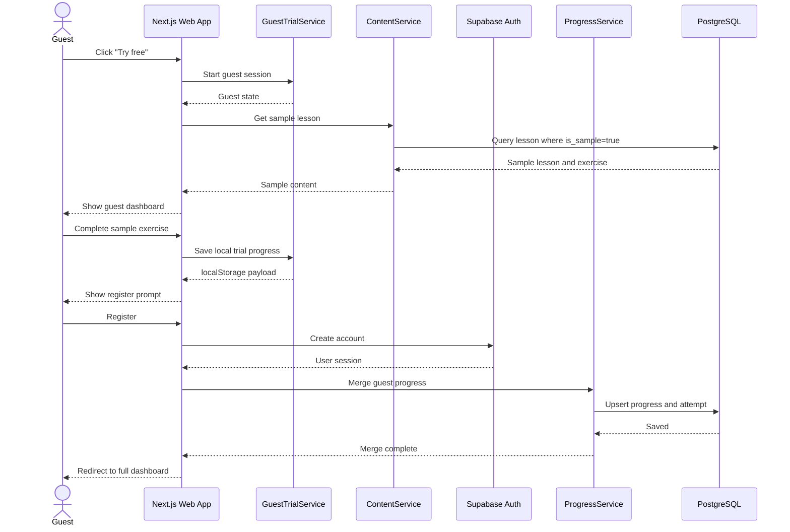
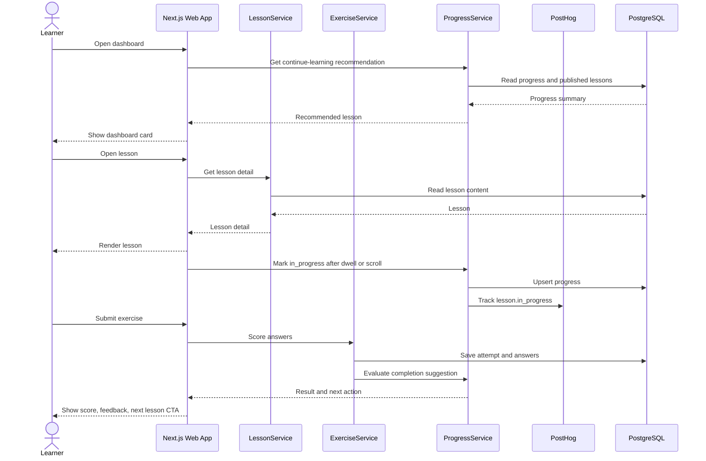
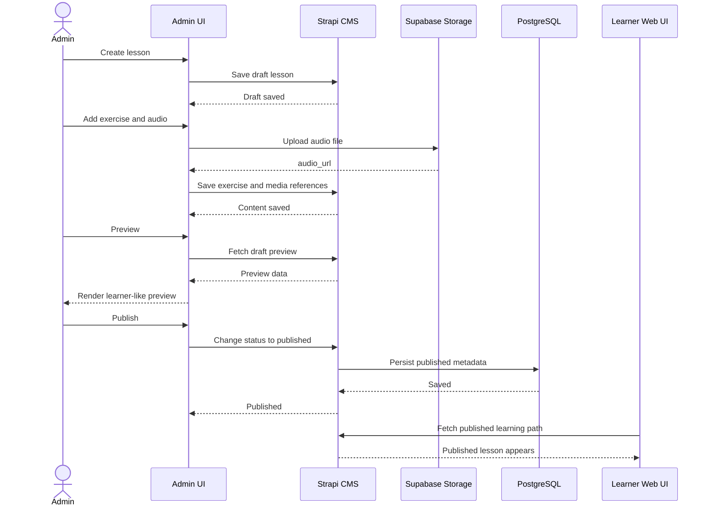

# Francais.vn Diagram Set

This file uses Markdown-native text diagrams for every diagram except the three sequence diagrams, which intentionally remain Mermaid.

## 1. System Modeling

### 1.1 Context Model

```text
Actors:
  Guest User
  Learner
  Admin / Founder

                         +--------------------------------+
                         |      Francais.vn Platform      |
                         |--------------------------------|
Guest User ------------> | Next.js Web App                |
Learner ---------------> | API Routes / Server Actions    |
Admin / Founder -------> | Application Services           |
                         +--------------------------------+
                                      |
                                      v
        +-----------------------------+-----------------------------+
        |              |              |              |              |
        v              v              v              v              v
+---------------+ +-------------+ +-------------+ +----------+ +-------------+
| Supabase Auth | | PostgreSQL  | | Supabase    | | Strapi   | | Email       |
|               | | Database    | | Storage     | | CMS      | | Provider    |
+---------------+ +-------------+ +-------------+ +----------+ +-------------+
        |
        +-----------------------------+-----------------------------+
                                      |                             |
                                      v                             v
                              +---------------+             +-------------+
                              | PostHog       |             | Sentry      |
                              | Analytics     |             | Monitoring  |
                              +---------------+             +-------------+

Hosting: Vercel serves the Next.js web application.
```

### 1.2 UML Class Diagram

```text
+------------------+        1      0..1     +------------------+
| User             |------------------------>| UserGoal         |
|------------------|                         |------------------|
| id               |                         | userId           |
| email            |                         | goal             |
| passwordHash     |                         | examDate         |
| role             |                         +------------------+
| createdAt        |
| lastLogin        |        1      0..*     +------------------+
+------------------+------------------------>| Progress         |
        |                                    |------------------|
        | 1                                  | userId           |
        |                                    | lessonId         |
        | 0..*                               | state            |
        v                                    | lastVisited      |
+------------------+                         | completedAt      |
| Note             |                         +------------------+
|------------------|
| id               |        1      0..*     +------------------+
| userId           |------------------------>| ExerciseAttempt  |
| lessonId         |                         |------------------|
| title            |                         | id               |
| bodyMd           |                         | userId           |
| createdAt        |                         | exerciseId       |
| updatedAt        |                         | score            |
+------------------+                         | total            |
                                             | submittedAt      |
                                             +------------------+

+------------------+        1      0..*     +------------------+
| Level            |------------------------>| TopicGroup       |
|------------------|                         |------------------|
| id               |                         | id               |
| name             |                         | levelId          |
| order            |                         | nameVi           |
+------------------+                         | order            |
                                             +------------------+
                                                      |
                                                      | 1 to 0..*
                                                      v
                                             +------------------+
                                             | Lesson           |
                                             |------------------|
                                             | id               |
                                             | topicGroupId     |
                                             | title            |
                                             | contentMd        |
                                             | order            |
                                             | status           |
                                             | isSample         |
                                             | publishedAt      |
                                             +------------------+
                                               |       |       |
                                      1  0..*  |       |       | 1  0..*
                                               v       v       v
                                      +----------+ +----------+ +------------+
                                      | Exercise | |Dictation | | Shadowing  |
                                      +----------+ +----------+ +------------+
                                           |
                                           | 1 to 1..*
                                           v
                                      +----------+
                                      | Question |
                                      +----------+
                                           |
                                           | 1 to 0..*
                                           v
                              +--------------------------+
                              | ExerciseAttemptAnswer    |
                              +--------------------------+

Other relationships:
  User 1 -> 0..* Bookmark
  User 1 -> 0..* DictationAttempt
  Dictation 1 -> 0..* DictationAttempt
  ExerciseAttempt 1 -> 1..* ExerciseAttemptAnswer
```

### 1.3 Sequence Diagram: Guest Trial To Register



### 1.4 Sequence Diagram: Lesson To Exercise Progress



### 1.5 Sequence Diagram: Admin Publish Content



### 1.6 State Diagram: Lesson Progress

```text
          open lesson + dwell 30s
          or scroll 30 percent
    +--------------------------------+
    |                                v
+-------------+                +-------------+
| NotStarted  |                | InProgress  |
+-------------+                +-------------+
                                      |
                                      | click complete lesson
                                      | or confirm after exercise pass
                                      v
                                +-------------+
                                | Completed   |
                                +-------------+
                                      ^
                                      |
                                      | revisit lesson keeps state
                                      |
                                +-------------+

Admin unpublish behavior:
  InProgress -> HiddenFromLearner -> InProgress when republished
  Completed  -> HiddenFromLearner -> Completed when republished
```

### 1.7 State Diagram: Content Publishing

```text
          publish
+-------+ -------> +-----------+
| Draft |          | Published |
+-------+ <------- +-----------+
    |     unpublish      |
    |                    | edit live content
    | delete draft       v
    |              +-----------+
    +------------> | Published |
                   +-----------+
                         |
                         | soft delete
                         v
                    +---------+
                    | Deleted |
                    +---------+
```

### 1.8 State Diagram: Auth Session

```text
+-----------+  try free   +---------------+  open second lesson  +--------------+
| Anonymous | ----------> | GuestBrowsing | -------------------> | GuestAtLimit |
+-----------+             +---------------+                      +--------------+
      |                          |                                      |
      | sign up                  | click register                       | click register
      v                          v                                      v
+-------------+          +-------------+                         +-------------+
| Registering | -------> |Authenticated| <---------------------- | Registering |
+-------------+ account  +-------------+                         +-------------+
                          |         ^
                          |         |
                          |         | sign in again
                          v         |
                     +---------+    |
                     | Expired | ---+
                     +---------+
                          ^
                          |
                 token expired and refresh failed

Authenticated -- logout --> Anonymous
Anonymous -- sign in --> Authenticating -- valid credentials --> Authenticated
```

### 1.9 Activity Diagram: Guest Trial

```text
Start
  |
  v
Open landing page
  |
  v
Click "Try free"
  |
  v
Open guest dashboard
  |
  v
Open sample lesson
  |
  v
Read lesson
  |
  v
Complete sample exercise
  |
  v
Show soft register prompt
  |
  +-- User registers? -- Yes --> Create account --> Merge guest progress --> Full dashboard --> End
  |
  +-- No ----------------------> Continue guest with banner
                                  |
                                  +-- Open second lesson? -- Yes --> Hard register modal --> End
                                  |
                                  +-- No -----------------------> Guest dashboard
```

### 1.10 Activity Diagram: Core Learning Loop

```text
Start
  |
  v
Open dashboard
  |
  +-- Has in-progress lesson? -- Yes --> Show continue lesson --+
  |                                                            |
  +-- No --> Suggest first or next lesson ----------------------+
                                                               |
                                                               v
                                                        Open lesson detail
                                                               |
                                                               v
                                                           Read lesson
                                                               |
                                                               v
                                                        Mark in_progress
                                                               |
                                  +-- Has exercise? -- No --> Click complete lesson
                                  |
                                  +-- Yes --> Open exercise
                                               |
                                               v
                                         Answer questions
                                               |
                                               v
                                         Submit exercise
                                               |
                                               v
                                      Show feedback and score
                                               |
                         +-- Score >= 70%? -- Yes --> Suggest mark completed
                         |
                         +-- No ----------------------> Retry exercise

Click complete / confirmed complete
  |
  v
Update progress
  |
  v
Show next lesson CTA
  |
  v
End
```

### 1.11 Activity Diagram: Admin Content Publishing

```text
Start
  |
  v
Admin login
  |
  +-- Role is admin? -- No --> Reject access --> End
  |
  +-- Yes
       |
       v
Open admin dashboard
       |
       v
Create or edit lesson
       |
       v
Attach exercise or dictation
       |
       v
Preview learner view
       |
       +-- Content OK? -- No --> Create or edit lesson
       |
       +-- Yes
            |
            v
Publish content
            |
            v
Content visible in learning path
            |
            v
End
```

## 2. Architectural Design

### 2.1 MVC Architecture

```text
+------------------------------+
| View                         |
|------------------------------|
| Dashboard UI                 |
| Learning Path UI             |
| Lesson Detail UI             |
| Exercise UI                  |
| Notes UI                     |
| Admin Screens                |
+--------------+---------------+
               |
               v
+------------------------------+
| Controller                   |
|------------------------------|
| Next.js Routes               |
| API Handlers                 |
| Server Actions               |
| Auth Guards                  |
| Form Handlers                |
+--------------+---------------+
               |
               v
+------------------------------+
| Model                        |
|------------------------------|
| User                         |
| Lesson / Exercise / Dictation|
| Progress                     |
| Attempt                      |
| Note                         |
| Bookmark                     |
+------------------------------+

Flow:
  View -> Controller -> Model -> Controller -> View
```

### 2.2 Layered Architecture

```text
+------------------------------------------------------+
| Presentation Layer                                   |
| React components, pages, layouts, forms, UI states    |
+--------------------------+---------------------------+
                           |
                           v
+------------------------------------------------------+
| Controller / API Layer                               |
| Routes, request validation, auth checks, responses    |
+--------------------------+---------------------------+
                           |
                           v
+------------------------------------------------------+
| Application Service Layer                            |
| AuthService, LessonService, ProgressService,          |
| ExerciseService, NoteService, DictationService        |
+--------------------------+---------------------------+
                           |
            +--------------+--------------+
            |                             |
            v                             v
+--------------------------+   +--------------------------+
| Domain Layer             |   | Repository Layer         |
| Progress rules, scoring, |   | UserRepository,          |
| guest limits, publishing |   | ContentRepository,       |
| rules                    |   | ProgressRepository, etc. |
+--------------------------+   +------------+-------------+
                                            |
                                            v
                              +----------------------------+
                              | Data Layer                 |
                              | Supabase PostgreSQL        |
                              | Strapi CMS                 |
                              | Supabase Storage           |
                              +----------------------------+
```

### 2.3 Repository Architecture / Data-Centered Architecture

```text
Application Services
  AuthService
  LessonService
  ExerciseService
  ProgressService
  NoteService
  DictationService
        |
        v
Repositories
  UserRepository
  ContentRepository
  ExerciseRepository
  ProgressRepository
  NoteRepository
  AttemptRepository
        |
        v
+--------------------------------------------------+
| Shared Data Sources                              |
|--------------------------------------------------|
| Supabase PostgreSQL                              |
|   - users, progress, notes, attempts, goals      |
| Strapi CMS                                       |
|   - lessons, exercises, questions, publishing    |
| Supabase Storage                                 |
|   - dictation and shadowing audio files          |
+--------------------------------------------------+

Mapping:
  AuthService      -> UserRepository      -> PostgreSQL
  LessonService    -> ContentRepository   -> Strapi CMS / PostgreSQL
  ExerciseService  -> ExerciseRepository  -> Strapi CMS / PostgreSQL
  ProgressService  -> ProgressRepository  -> PostgreSQL
  NoteService      -> NoteRepository      -> PostgreSQL
  DictationService -> ContentRepository   -> Strapi CMS / Storage
  DictationService -> AttemptRepository   -> PostgreSQL
```

### 2.4 Client-Server Architecture

```text
+--------------------------------------------------+
| Client                                           |
|--------------------------------------------------|
| Browser UI                                       |
| Guest pages, learner pages, admin pages          |
+--------------------------+-----------------------+
                           |
                           | HTTPS
                           v
+--------------------------------------------------+
| Server Side                                      |
|--------------------------------------------------|
| Next.js App Server                               |
| API Routes / Server Actions                      |
| Business Services                                |
+--------------------------+-----------------------+
                           |
                           v
+--------------------------------------------------+
| Managed Services                                 |
|--------------------------------------------------|
| Supabase Auth                                    |
| Supabase PostgreSQL                              |
| Supabase Storage                                 |
| Strapi CMS                                       |
| Email Provider                                   |
| PostHog Analytics                                |
| Sentry                                           |
+--------------------------------------------------+
```

### 2.5 Application Architecture: Data Processing Pipeline

```text
User Input Text
      |
      v
Normalize
  - lowercase
  - NFC unicode
  - collapse whitespace
      |
      v
Strip Extra Punctuation
  - ignore extra , . ? ! ; :
  - keep French accents
  - keep hyphens
      |
      v
Tokenize
  - split by whitespace
      |
      v
Compare Tokens
      |
      +--------------------+
      |                    |
      v                    v
Build Diff Highlights   Calculate Score / Accuracy
      |                    |
      +----------+---------+
                 |
                 v
Return Feedback
                 |
                 v
Save Attempt
```

## 3. Database Models

### 3.1 Entity Relationship Diagram

```text
+------------------+       1      0..1      +------------------+
| USER             |------------------------>| USER_GOAL        |
+------------------+                         +------------------+
| id PK            |                         | user_id PK/FK    |
| email            |                         | goal             |
| password_hash    |                         | exam_date        |
| role             |                         +------------------+
| created_at       |
| last_login       |       1      0..*      +------------------+
+------------------+------------------------>| PROGRESS         |
        |                                   +------------------+
        | 1                                 | user_id PK/FK    |
        |                                   | lesson_id PK/FK  |
        | 0..*                              | state            |
        v                                   | last_visited     |
+------------------+                        | completed_at     |
| NOTE             |                        +------------------+
+------------------+
| id PK            |       1      0..*      +------------------+
| user_id FK       |------------------------>| EXERCISE_ATTEMPT |
| lesson_id FK     |                        +------------------+
| title            |                        | id PK            |
| body_md          |                        | user_id FK       |
| created_at       |                        | exercise_id FK   |
| updated_at       |                        | score            |
+------------------+                        | total            |
                                            | duration_sec     |
                                            | submitted_at     |
                                            +------------------+

+------------------+       1      0..*      +------------------+
| LEVEL            |------------------------>| TOPIC_GROUP      |
+------------------+                        +------------------+
| id PK            |                        | id PK            |
| name             |                        | level_id FK      |
| order            |                        | name_vi          |
+------------------+                        | order            |
                                            +--------+---------+
                                                     |
                                                     | 1 to 0..*
                                                     v
                                            +------------------+
                                            | LESSON           |
                                            +------------------+
                                            | id PK            |
                                            | topic_group_id FK|
                                            | title            |
                                            | content_md       |
                                            | order            |
                                            | status           |
                                            | is_sample        |
                                            | published_at     |
                                            +--------+---------+
                                                     |
                  +----------------------------------+----------------------------------+
                  |                                  |                                  |
                  v                                  v                                  v
          +---------------+                  +----------------+                 +---------------+
          | EXERCISE      |                  | DICTATION      |                 | SHADOWING     |
          +---------------+                  +----------------+                 +---------------+
          | id PK         |                  | id PK          |                 | id PK         |
          | lesson_id FK  |                  | lesson_id FK   |                 | lesson_id FK  |
          | status        |                  | audio_url      |                 | audio_url     |
          +-------+-------+                  | transcript     |                 | transcript    |
                  |                          | duration_sec   |                 +---------------+
                  | 1 to 1..*                +--------+-------+
                  v                                   |
          +---------------+                           | 1 to 0..*
          | QUESTION      |                           v
          +---------------+                  +-------------------+
          | id PK         |                  | DICTATION_ATTEMPT |
          | exercise_id FK|                  +-------------------+
          | type          |                  | id PK             |
          | payload       |                  | user_id FK        |
          | explanation   |                  | dictation_id FK   |
          +-------+-------+                  | user_input        |
                  |                          | accuracy          |
                  |                          | submitted_at      |
                  v                          +-------------------+
     +--------------------------+
     | EXERCISE_ATTEMPT_ANSWER |
     +--------------------------+
     | id PK                    |
     | attempt_id FK            |
     | question_id FK           |
     | answer                   |
     | is_correct               |
     +--------------------------+

Other table:
  BOOKMARK(user_id PK/FK, target_type, target_id, created_at)
```

## 4. Core User Flow Models

### 4.1 Page Map

```text
Landing Page
  |
  +--> Guest Dashboard
  |       |
  |       +--> Guest Sample Lesson
  |               |
  |               +--> Guest Sample Exercise
  |                       |
  |                       +--> Sign Up / Sign In
  |
  +--> Sign Up / Sign In
          |
          +--> Authenticated Dashboard
          |       |
          |       +--> Learning Path
          |       |       |
          |       |       +--> Lesson Detail
          |       |
          |       +--> Lesson Detail
          |       |       |
          |       |       +--> Exercise
          |       |       +--> Dictation Practice
          |       |       +--> Shadowing Practice
          |       |
          |       +--> Notes Page
          |       +--> Saved Items
          |       +--> Goal / Countdown Setup
          |
          +--> Admin CMS
```

### 4.2 Returning Learner Flow

```text
Dashboard
  |
  +-- Has unfinished lesson? -- Yes --> Resume latest in-progress lesson
  |                                      |
  |                                      v
  +-- No --> Recommend next lesson --> Lesson Detail
                                      |
                                      v
                              Exercise or Dictation
                                      |
                                      v
                              Update progress
                                      |
                                      v
                              Show next lesson
                                      |
                                      v
                                  Dashboard
```

### 4.3 Quick Note Flow

```text
Lesson / Exercise / Dictation
  |
  v
Click Quick Note button
  |
  +-- First open in session? -- Yes --> Choose create new or select existing
  |                                      |
  |                                      +-- Create new --> Create note linked to lesson
  |                                      |
  |                                      +-- Select existing --> Load selected note
  |
  +-- No --> Open last active note
                  |
                  v
            Open slide-over panel
                  |
                  v
              Edit note
                  |
                  v
        Autosave after 1 second
                  |
                  v
        Visible on Notes Page
                  |
                  v
        Close panel and return to learning
```

### 4.4 Dictation Flow

```text
Open dictation practice
  |
  v
Play audio
  |
  v
Type transcript
  |
  +-- Submit empty? -- Yes --> Ask confirmation
  |                            |
  |                            v
  +-- No ----------------> Normalize and tokenize input
                              |
                              v
                       Compare with transcript
                              |
                              v
                       Show token-level diff
                              |
                              v
                       Calculate accuracy
                              |
                              v
                       Save dictation attempt
                              |
                              v
                       Show retry or next lesson CTA
```

### 4.5 Admin Core Flow

```text
Admin login
  |
  v
Admin dashboard
  |
  v
Create lesson
  |
  v
Create exercise or dictation
  |
  v
Preview learner view
  |
  +-- Ready to publish? -- No --> Create lesson / edit content
  |
  +-- Yes
       |
       v
Publish
       |
       v
Lesson appears for learners
       |
       +-- Need fix? -- Yes --> Unpublish or edit live content --> Preview learner view
       |
       +-- No --> Done
```
