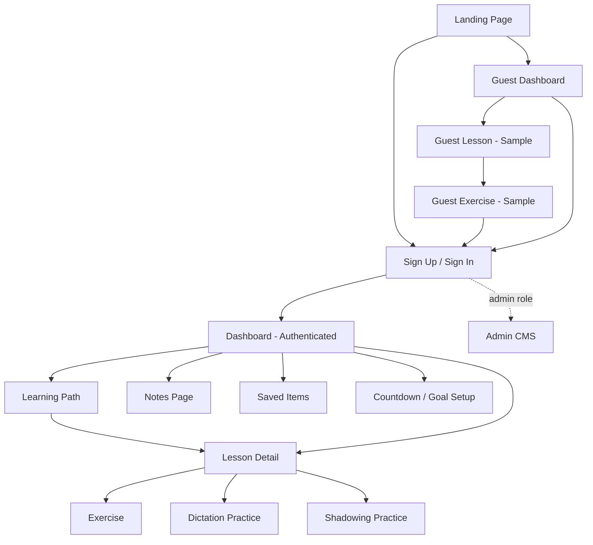
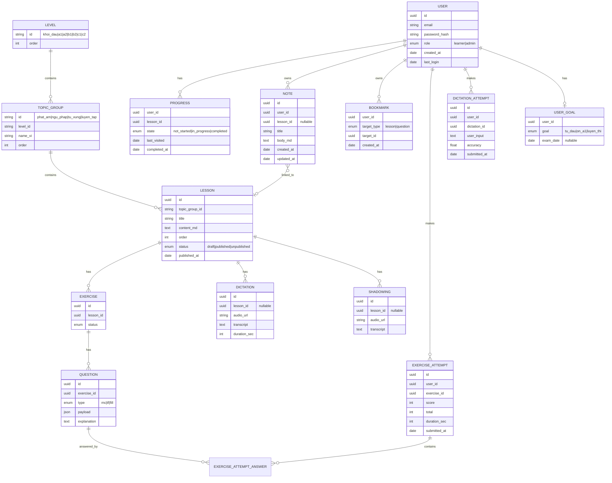
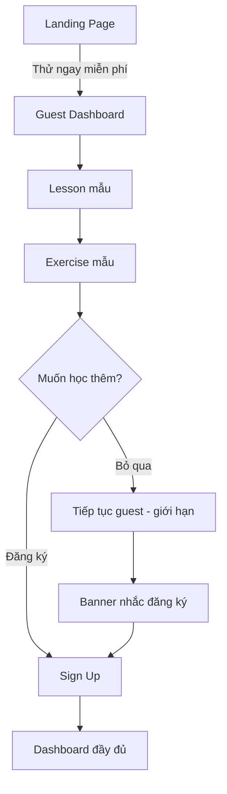
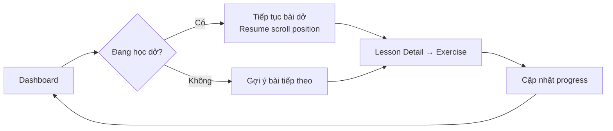
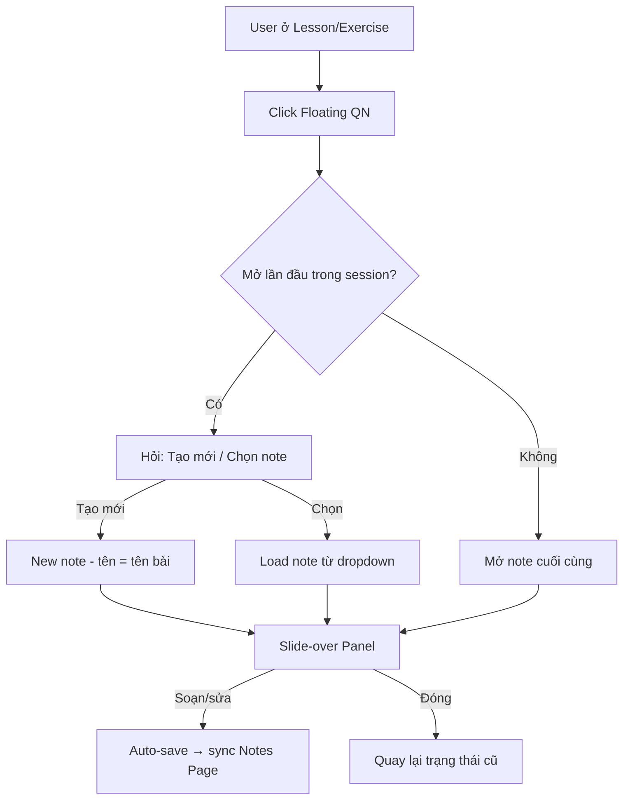
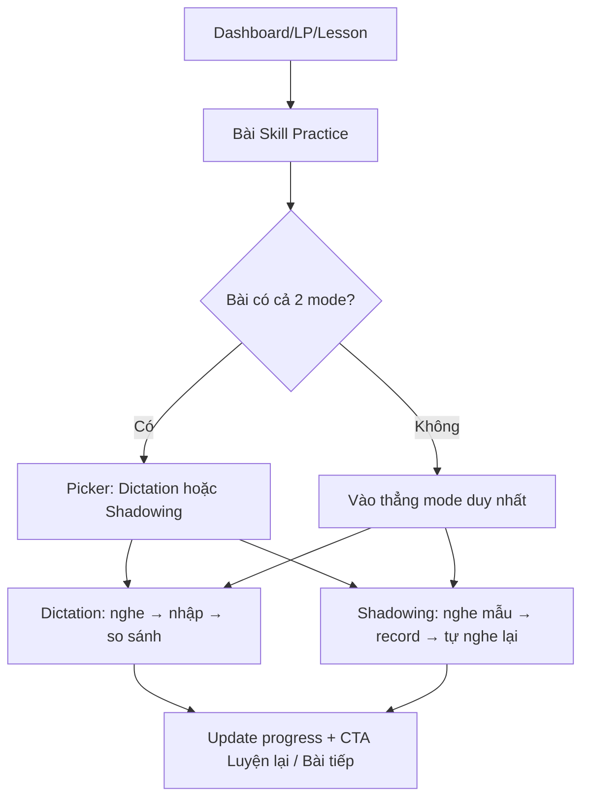
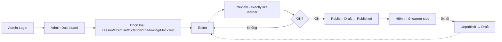

# Product Requirements Document — Francais.vn

**Author:** Phuon
**Date:** 2026-05-14
**Version:** 2.0 (Consolidated / Implementation-Ready)
**Status:** Draft → pending founder review on §11 Open Decisions
**Companion docs:** `prd-features.md` (detailed FR), `sprint-plan.md`, `open-decisions.md`

---

## 1. Product Overview

### 1.1 Elevator Pitch
Francais.vn là nền tảng tự học tiếng Pháp dành cho người Việt: lộ trình Khởi đầu + A1, micro-exercise, nghe chép chính tả, ghi chú trong khi học, và (sau MVP) luyện thi chứng chỉ. Mobile-first, web-only ở MVP.

### 1.2 Vision
Trở thành nền tảng tự học tiếng Pháp số 1 cho người Việt — nơi mọi người xây nền tảng vững, luyện thi hiệu quả, duy trì động lực thông qua lộ trình cá nhân hóa và Quick Note thông minh.

### 1.3 Strategic Pillars (MVP)
| # | Pillar | Tại sao quan trọng |
|---|---|---|
| 1 | **Lộ trình rõ ràng** | Người mới luôn biết bước tiếp theo, không bị lạc |
| 2 | **Học chủ động qua bài tập** | Exercise + Dictation đi kèm từng lesson, không chỉ đọc thụ động |
| 3 | **Quick Note** | UX khác biệt — ghi chú ngay trong bài học, không phải mở tab khác |
| 4 | **Guest trial trước login wall** | Giảm friction đầu phễu; user thấy giá trị trước khi đăng ký |
| 5 | **Admin tự vận hành** | 1 người tạo & publish content không cần dev |

### 1.4 Target Audience
| Persona | Quy mô MVP | Channel |
|---|---|---|
| Người xây nền tảng (sinh viên, mới bắt đầu) | Primary | SEO, social |
| Người luyện thi cấp tốc (DELF/TEF/TCF, PR Canada) | Secondary — Mock Test ở Sprint 3+ | SEO "ôn DELF" |
| Admin (1 người, founder) | Internal | CMS web |

### 1.5 Success Metrics — MVP (tháng đầu sau launch)
| Metric | Target | Đo bằng |
|---|---|---|
| User đăng ký | ≥ 50 | Analytics |
| Guest → Register conversion | ≥ 20% | Funnel event |
| Tỷ lệ hoàn thành bài học đầu tiên | ≥ 60% | Progress event |
| D7 retention | ≥ 30% | Analytics |
| Bài học published trước launch | ≥ 20 | CMS count |
| Quick Note adoption (user tạo ≥ 1 note) | ≥ 25% | DB count |

---

## 2. Personas (Tóm tắt)

| Persona | Tên | Mục tiêu | Pain point chính | Cần ở MVP |
|---|---|---|---|---|
| **Người xây nền tảng** | Lan, 22, sinh viên | Học A1 trước du học | Học lan man, mất động lực | Lộ trình + bài tập + progress + Quick Note |
| **Người luyện thi cấp tốc** | Minh, 28, văn phòng | DELF B1 trong 3 tháng | Không biết mình đã đạt aim chưa | Countdown ngày thi (Should), Mock Test (Sprint 3+) |
| **Admin** | Phuon (founder) | Tạo & publish content | Cần CMS đơn giản, vận hành nhanh | Lesson/Exercise/Dictation CRUD + Publish state |

Chi tiết persona xem `prd-features.md` không lặp lại — đây là tóm tắt làm việc.

---

## 3. MVP Scope & Feature Priority

### 3.1 Priority Matrix (Reconciled — v2 ground truth)
| Feature | Priority | Sprint | Lưu ý |
|---|---|---|---|
| Auth (email + password) | Must | 1 | Persistent session 30d |
| Guest Trial Flow | **Must (NEW)** | 1 | Trước MVP launch — chốt limits ở §11 |
| Dashboard | Must | 1 | Card "Học tiếp" là center piece |
| Learning Path | Must | 1 | Không khóa bài, free navigation |
| Lesson Detail | Must | 1 | Mobile-first |
| Exercise (MC / T-F / Fill) | Must | 1 | Feedback ngay, retry được |
| Progress Tracking | Must | 1 | Backbone của Dashboard & LP |
| Quick Note + Notes Page | Must | 1–2 | Floating button + slide-over |
| Admin CMS (Lesson + Exercise + Publish) | Must | 1–2 | 1 admin, no role mgmt |
| Dictation Practice | Must | 2 | Audio + transcript compare |
| Google OAuth | Should | 2 | Reduce signup friction |
| Bookmark bài học/câu hỏi | Should | 2 | Retention |
| Onboarding chọn mục tiêu | Should | 2 | Goal: "Từ đầu" / "Ôn A1" / "Thi" |
| Countdown ngày thi | Should | 2 | Cho persona Minh |
| Admin: Dictation editor + audio upload | Should | 2 | Phụ thuộc Dictation feature |
| Saved Mistakes | Could | 3 | Sau khi Exercise stabilize |
| Shadowing Practice | Could | 3 | Record + replay, không AI |
| Streak / Study Streak | Could | 3 | Retention sau khi progress ổn |
| Daily Goal | Could | 3 | — |
| Mock Test (full) | Later | 4+ | Phụ thuộc Exercise + Timer |
| Timer thi thật | Later | 4+ | Phụ thuộc Mock Test |
| AI Correction | Later | — | Không vào MVP |
| Payment / Subscription | Later | — | Validate value trước |
| Community / Forum | Later | — | Moderation chi phí cao |
| Placement Test | Later | — | Cần exercise bank lớn |
| Multi-admin / RBAC | Later | — | 1 admin đủ |
| Gamification nâng cao (badge/XP/level) | Later | — | Sau khi có streak |

> **Conflict resolved:** Shadowing trong v1 PRD ghi Sprint 2 / Must-have, v1 features doc ghi Could-have. **Ground truth v2 = Could-have, Sprint 3.** Lý do: cần microphone permission, record API trên cả mobile + desktop, không phải core học path.

### 3.2 Out of Scope (MVP)
Payment, AI grading, community, native mobile app, placement test, full mock test với timer, multi-admin, push notifications, email drip campaigns.

---

## 4. System Architecture & Information Architecture

### 4.1 Page Map


### 4.2 Quick Note Visibility Rule
| Screen | Floating QN button | Notes Page sync |
|---|---|---|
| Landing / Auth / Guest pages | ❌ | — |
| Dashboard | ❌ (link in nav) | — |
| Lesson Detail | ✅ | Realtime |
| Exercise (regular) | ✅ | Realtime |
| Dictation Practice | ✅ | Realtime |
| Shadowing Practice | ✅ | Realtime |
| Mock Test / Timeblock mode | ❌ (toast "Không có ghi chú trong chế độ thi") | — |
| Admin CMS | ❌ | — |

### 4.3 Tech Stack (Recommended — see §11 for confirm)
| Layer | Choice | Lý do |
|---|---|---|
| Frontend | Next.js 14 (App Router) + React + Tailwind | Mobile-first, SEO friendly cho landing |
| Backend / CMS | **Strapi (headless CMS)** | Admin UI miễn phí + rich text editor có sẵn |
| DB | PostgreSQL (Supabase managed) | — |
| Auth | Supabase Auth (email/password + Google OAuth) | OAuth có sẵn, JWT 30d |
| File storage | Supabase Storage | Audio files dictation/shadowing |
| Hosting | Vercel (FE) + Supabase (BE) + Strapi self-hosted hoặc Render | — |
| Analytics | PostHog hoặc Plausible | Funnel + retention |

---

## 5. Data Model (High-Level)



---

## 6. Core User Flows

### 6.1 Flow 0 — Guest Trial → Register (NEW in v2, from image.png)


| Step | User action | System | Screen |
|---|---|---|---|
| 1 | Bấm "Thử ngay miễn phí" | → Guest Dashboard | Landing |
| 2 | Xem lộ trình overview + 1 bài mẫu | Read-only | Guest Dashboard |
| 3 | Mở Lesson mẫu | Đọc bài, thử Quick Note (in-memory, không lưu) | Guest Lesson |
| 4 | Mở Exercise mẫu (2–3 câu) | Feedback inline | Guest Exercise |
| 5 | Sau Exercise → banner "Muốn học thêm?" | Soft prompt (modal nhẹ) | Guest Exercise Result |
| 6a | Skip | Trở về Guest Dashboard, hiện limit indicator | Guest Dashboard |
| 6b | Register | Sign up form (email/Google) | Sign Up |
| 7 | Sau register | Migrate guest progress → user account | Full Dashboard |

**Nguyên tắc:** Không chặn cứng. Register là natural step sau khi thấy giá trị. Số bài guest free phải chốt — xem §11 OD-01.

### 6.2 Flow 1 — Returning Learner học tiếp


### 6.3 Flow 2 — Khám phá Learning Path
`Learning Path → chọn level → chọn bất kỳ bài → Lesson → Exercise → Completed → highlight bài kế tiếp`

### 6.4 Flow 3 — Quick Note


**Edge cases:**
- Mock Test → QN button ẩn; click vào vùng tương đương → toast "Không có ghi chú trong chế độ thi"
- Note đang mở → user navigate sang lesson khác → save & close panel; nếu mở lại sẽ là note mới (theo lesson hiện tại) hoặc dropdown

### 6.5 Flow 4 — Skill Practice (Dictation / Shadowing)


### 6.6 Flow 5 — Admin tạo nội dung


---

## 7. State Machines

### 7.1 Lesson Progress (per user × lesson)
```
not_started → in_progress → completed
   ▲             │              │
   └─────────────┴── (admin unpublish ẩn lesson, progress giữ nguyên trong DB)
```
- Trigger `in_progress`: user mở Lesson Detail lần đầu
- Trigger `completed`: user bấm CTA "Hoàn thành bài" hoặc submit Exercise của lesson đó với score ≥ pass threshold (xem §11 OD-05)

### 7.2 Content Publishing (Lesson / Exercise / Dictation / Shadowing)
```
draft ─publish→ published ─unpublish→ draft
draft ─delete→ (gone)
```
- Unpublish KHÔNG xóa data — chỉ ẩn khỏi learner side.
- Admin sửa published content → giữ ở `published` (không tự xuống draft). Optional: warning "Đang sửa nội dung đã publish".

### 7.3 Note
```
created (empty) → editing → saved (debounced 1s) → editing → … → deleted
```

### 7.4 Auth Session
```
anonymous (guest) → registering → authenticated (30d JWT) → expired/logout → anonymous
                  ─Google OAuth─↗
guest_progress (localStorage) → merged into user on first auth
```

---

## 8. Non-Functional Requirements
| ID | NFR | Detail | Priority |
|---|---|---|---|
| NFR-01 | Responsive | Mobile-first ≥ 320px, tablet, desktop | Must |
| NFR-02 | Performance | LCP < 3s trên 3G, TTI < 5s | Must |
| NFR-03 | SEO | Landing page có meta, OG, sitemap | Should |
| NFR-04 | A11y | Contrast ≥ 4.5:1, body ≥ 16px, keyboard nav cho Exercise | Should |
| NFR-05 | Security | HTTPS, JWT, input sanitization, CORS, no PII in logs | Must |
| NFR-06 | Backup | DB backup daily, audio storage versioning | Must |
| NFR-07 | Browser | Chrome / Safari / Firefox — 2 phiên bản mới nhất | Must |
| NFR-08 | Audio | Format MP3, ≤ 2MB / file, ≤ 30s cho dictation chunk | Must |
| NFR-09 | i18n | UI hardcoded tiếng Việt MVP; key-based i18n optional | Could |
| NFR-10 | Observability | Error logging (Sentry), basic analytics events | Should |

---

## 9. Constraints & Assumptions
- 1 admin vận hành — không cần RBAC.
- MVP miễn phí — không có payment.
- Không dùng AI — dictation = string compare có normalize.
- ≥ 20 lessons published & ≥ 5 dictation bài trước launch.
- User có internet ổn định, không có offline mode.

---

## 10. Cross-References
| Topic | Doc |
|---|---|
| Chi tiết FR từng feature, edge cases, AC | `prd-features.md` |
| Sprint allocation chi tiết | `sprint-plan.md` |
| Open decisions cần founder confirm | `open-decisions.md` |
| Personas chi tiết | §2 (tóm tắt) — đầy đủ trong source `Documents 35f7…md` |

---

## 11. Open Decisions Snapshot
Đầy đủ ở `open-decisions.md`. Top blockers:

| ID | Decision | Default assumption v2 |
|---|---|---|
| OD-01 | Guest trial limits | 1 lesson + 1 exercise free; rồi soft register banner |
| OD-02 | Dictation text compare rules | Case-insensitive, normalize whitespace, **bỏ qua dấu câu**, **giữ accent (é è ê)** |
| OD-03 | Shadowing trong MVP? | Could-have / Sprint 3 (downgrade từ v1) |
| OD-04 | Tech stack Strapi vs Supabase chỉ | Strapi cho admin UI + Supabase cho auth/storage |
| OD-05 | "Hoàn thành bài" — manual hay auto sau Exercise pass? | Manual click; Exercise pass ≥ 70% suggest "đánh dấu hoàn thành" |
| OD-06 | Onboarding goal selection — mandatory? | Optional, có "Bỏ qua" |
| OD-07 | Countdown ngày thi UI ở đâu? | Card riêng trên Dashboard, ẩn nếu chưa set |
| OD-08 | Audio CDN | Supabase Storage MVP, CDN sau |
| OD-09 | Note rich-text scope | bold/italic/bullet only (no images, no embeds) |
| OD-10 | Migrate guest progress | Có — local storage progress merge vào user khi register |

---

> **Status:** Draft v2.0 — Ready for founder sign-off then Sprint 1 kickoff.
