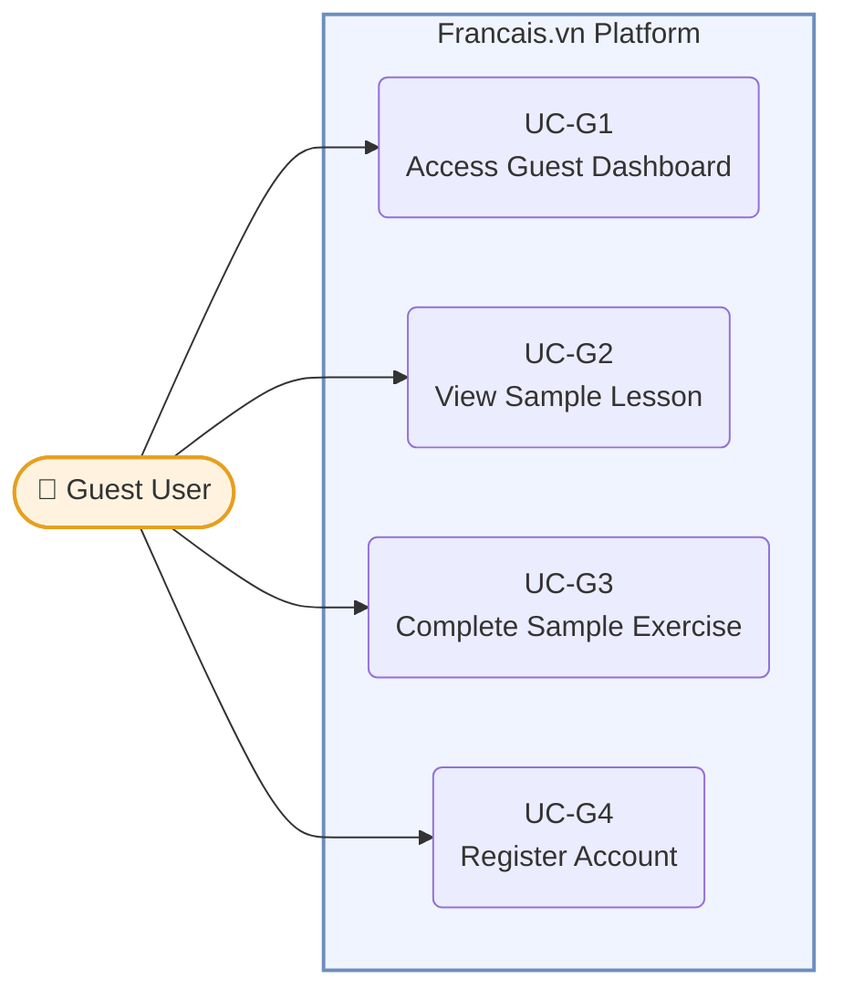
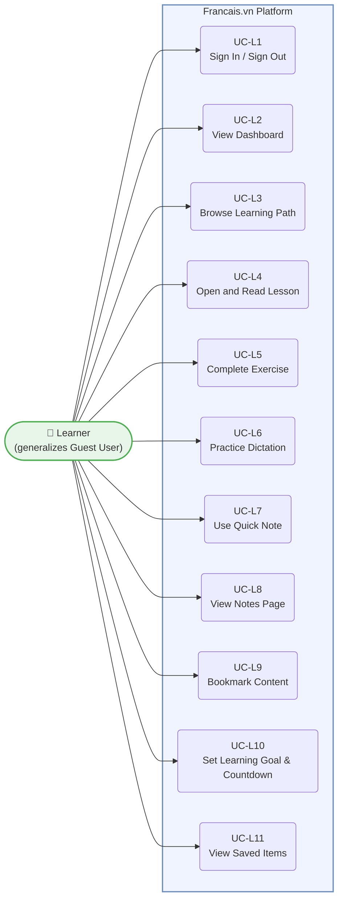
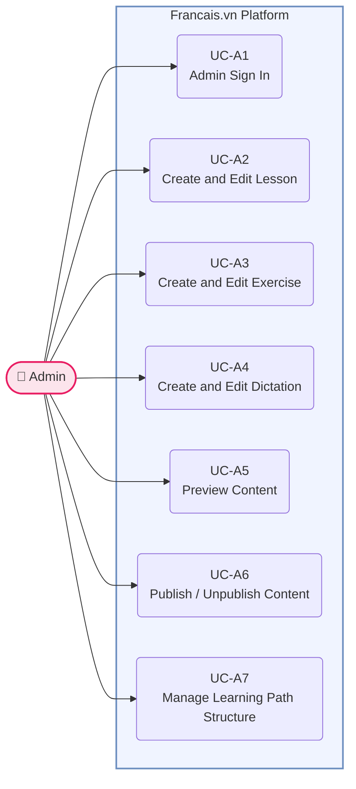
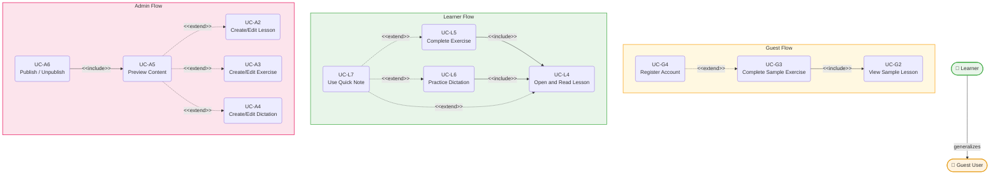

# Francais.vn — Use Case Diagrams & Specifications

---

## 1. Actors

| Actor | Type | Description |
|---|---|---|
| Guest User | Primary | Unauthenticated visitor. Can only access the guest trial flow. |
| Learner | Primary | Registered user who studies French through the platform. Inherits all Guest User capabilities. |
| Admin | Primary | Founder / operator who creates and publishes learning content. |
| Supabase Auth | Secondary | Handles JWT tokens, OAuth sessions, and token refresh. |
| Email Provider | Secondary | Sends password reset and account verification emails. |

> **Generalization:** Learner generalizes Guest User — a Learner can perform all Guest User use cases in addition to any use case that requires authentication.

---

## 2. Use Case Overview Diagram

### 2.1 Guest User

### 2.2 Learner

### 2.3 Admin

---

## 3. Relationship Diagram (Include / Extend / Generalization)

---

## 4. Use Case Specifications

---

### UC-G1: Access Guest Dashboard

| Field | Detail |
|---|---|
| **ID** | UC-G1 |
| **Actor** | Guest User |
| **Precondition** | The user is on the landing page and has not registered or signed in. |
| **Postcondition** | A guest session is created; the guest dashboard is displayed with a read-only learning path overview and one sample lesson. |

**Main Flow:**
1. Guest clicks "Try for free" on the landing page.
2. The system creates a guest session (client-state only, nothing persisted server-side).
3. The system loads the guest dashboard: a read-only learning path overview and one lesson marked `is_sample = true`.
4. The guest sees the dashboard with a button to open the sample lesson and a registration banner.

**Alternative Flow:**
- A1: A guest session already exists in the current browser tab → The system restores the guest state from `localStorage` without creating a new session.

**Exception Flow:**
- E1: Server does not respond → A generic error page is shown with a retry button.
- E2: No lesson with `is_sample = true` exists → A message is shown: "Content is being prepared."

---

### UC-G2: View Sample Lesson

| Field | Detail |
|---|---|
| **ID** | UC-G2 |
| **Actor** | Guest User |
| **Precondition** | The guest is on the guest dashboard (UC-G1 completed). |
| **Postcondition** | The sample lesson content is displayed in read-only mode. |

**Main Flow:**
1. Guest clicks the sample lesson card on the guest dashboard.
2. The system queries the lesson with `is_sample = true` and `status = published`.
3. Lesson content is rendered: markdown, callouts, and audio examples.
4. The Quick Note button is hidden because the guest is not signed in.
5. A call-to-action "Try the sample exercise" is shown at the bottom.

**Alternative Flow:**
- A1: Guest scrolls to the end without opening the exercise → A soft banner is shown: "Sign up to continue learning."

**Exception Flow:**
- E1: The sample lesson has been unpublished by the admin → A message is shown: "This content is temporarily unavailable."

---

### UC-G3: Complete Sample Exercise

| Field | Detail |
|---|---|
| **ID** | UC-G3 |
| **Actor** | Guest User |
| **Precondition** | The guest is viewing the sample lesson (UC-G2 completed); the lesson has an exercise. |
| **Postcondition** | The exercise result is saved to `localStorage`; a registration prompt is shown. |

**Main Flow:**
1. Guest clicks "Try the sample exercise."
2. The exercise renders 2–3 questions (MC / True-False / Fill-in-the-blank).
3. The guest answers each question; the system shows inline feedback after each answer.
4. The guest submits the exercise.
5. The system calculates the total score and displays the result.
6. The score and completion state are saved to `localStorage`.
7. A soft registration prompt is shown: "Want to learn more? Sign up for free."

**Alternative Flow:**
- A1: Guest skips the exercise and navigates away → Returns to the guest dashboard with a registration banner.

**Exception Flow:**
- E1: Guest attempts to open a second lesson → A hard registration modal appears; the guest cannot proceed without signing up.

---

### UC-G4: Register Account

| Field | Detail |
|---|---|
| **ID** | UC-G4 |
| **Actor** | Guest User |
| **Precondition** | The guest has seen the registration prompt (from UC-G3 or by clicking Sign Up directly). |
| **Postcondition** | Account is created; guest progress is merged into the new account; the learner is redirected to the full authenticated dashboard. |

**Main Flow:**
1. Guest clicks "Sign Up" from the registration prompt.
2. A registration form is shown (email + password).
3. Guest enters a valid email and a password (at least 8 characters, at least 1 digit).
4. The system creates the account via Supabase Auth.
5. A verification email is sent via the Email Provider.
6. After verification, the system merges `localStorage` progress (lesson view, exercise score) into the new user record.
7. The learner is redirected to the onboarding goal selection screen.
8. After onboarding (or skip), the learner is redirected to the full authenticated dashboard.

**Alternative Flow:**
- A1: Guest selects Google OAuth → The email/password form is skipped; the OAuth flow runs; progress is merged after OAuth completes.

**Exception Flow:**
- E1: Email already exists → An error is shown: "This email is already registered. Sign in instead?"
- E2: Password does not meet requirements → Specific requirements are shown inline on the field.
- E3: Network interruption → Form state is preserved; an error is shown: "Could not connect. Please try again."

---

### UC-L1: Sign In / Sign Out

| Field | Detail |
|---|---|
| **ID** | UC-L1 |
| **Actor** | Learner |
| **Precondition** | The learner has an existing account. |
| **Postcondition** | Sign in: a 30-day JWT session is created; the learner is redirected to the dashboard. Sign out: the session is cleared; the learner is redirected to the landing page. |

**Main Flow (Sign In):**
1. Learner opens the Sign In page and enters email and password.
2. The system authenticates via Supabase Auth.
3. A 30-day JWT is created and stored.
4. Learner is redirected to the authenticated dashboard.

**Main Flow (Sign Out):**
1. Learner clicks "Sign Out" from the navigation menu.
2. The system clears the JWT session.
3. Learner is redirected to the landing page.

**Alternative Flow:**
- A1 (Google OAuth): Learner clicks "Sign in with Google" → OAuth flow runs → JWT session is created → Dashboard.
- A2 (Reset Password): Learner clicks "Forgot password" → Enters email → Email Provider sends a reset link → Learner sets a new password.

**Exception Flow:**
- E1: Wrong email or password → A generic error is shown (neither field is identified as the source of the error).
- E2: Five failed attempts within 15 minutes → The IP / account is temporarily rate-limited; a message is shown.
- E3: JWT expires while the learner is active → The system automatically refreshes the token; if refresh fails → redirect to Sign In.

---

### UC-L2: View Dashboard

| Field | Detail |
|---|---|
| **ID** | UC-L2 |
| **Actor** | Learner |
| **Precondition** | The learner is signed in. |
| **Postcondition** | The dashboard is displayed reflecting the learner's current learning state. |

**Main Flow:**
1. Learner opens the Dashboard page.
2. The system calls ProgressService to calculate the current learning state.
3. The dashboard renders based on one of four "Continue Learning" card states:
   - **New user:** "Start your first lesson" → links to the first lesson.
   - **In-progress:** "Continue: [lesson name]" → links to the unfinished lesson.
   - **Just completed:** "Next up: [lesson name]" → suggests the next lesson.
   - **All done:** "You have completed all available lessons!"
4. The dashboard also shows: level progress percentage, recent activity, and exam countdown (if a goal has been set).

**Alternative Flow:**
- A1: No lessons have been published yet → An empty state is shown: "Content is being prepared."

**Exception Flow:**
- E1: ProgressService times out → The dashboard is shown with skeleton loaders; automatic retry after 3 seconds.

---

### UC-L3: Browse Learning Path

| Field | Detail |
|---|---|
| **ID** | UC-L3 |
| **Actor** | Learner |
| **Precondition** | The learner is signed in. |
| **Postcondition** | The learning path is displayed grouped by level and topic group, with the status of each lesson. |

**Main Flow:**
1. Learner clicks "Learning Path" in the navigation.
2. The system loads all levels (Beginner, A1, A2, …) and topic groups (Pronunciation, Grammar, Vocabulary, Practice).
3. Each lesson is shown with one of three states: `not_started` / `in_progress` / `completed`.
4. The recommended next lesson is highlighted; no lessons are locked.
5. The learner can click any lesson to open it.

**Alternative Flow:**
- A1: Learner filters by level → Only lessons belonging to that level are shown.

**Exception Flow:**
- E1: No published lessons exist in a level → A message is shown: "No content available for this level yet."

---

### UC-L4: Open and Read Lesson

| Field | Detail |
|---|---|
| **ID** | UC-L4 |
| **Actor** | Learner |
| **Precondition** | The learner is signed in; the lesson has `status = published`. |
| **Postcondition** | The lesson status transitions to `in_progress` after the engagement threshold is met; the lesson content is fully displayed. |

**Main Flow:**
1. Learner clicks a lesson from the Dashboard or Learning Path.
2. The system renders the lesson content: headings, markdown body, note callouts, warning callouts, and audio examples.
3. A breadcrumb is displayed: Level > Topic Group > Lesson.
4. The floating Quick Note button appears in the corner.
5. After the learner dwells for ≥ 30 seconds **or** scrolls ≥ 30% of the content → the system calls ProgressService to set `state = in_progress`.
6. Calls-to-action are shown at the bottom:
   - If the lesson has an exercise → "Do the exercise."
   - If the lesson has a dictation → "Practice listening."
   - If neither → "Mark as complete."

**Alternative Flow:**
- A1: The lesson is already `completed` → It opens normally; the state is not changed; CTAs are still visible.
- A2: The lesson has both an exercise and a dictation → Both CTAs are shown.

**Exception Flow:**
- E1: The lesson is unpublished by the admin while the learner is reading it → A banner is shown: "This lesson is temporarily unavailable." Progress is preserved in the database.

---

### UC-L5: Complete Exercise

| Field | Detail |
|---|---|
| **ID** | UC-L5 |
| **Actor** | Learner |
| **Precondition** | A lesson is open (UC-L4 completed); the lesson has an exercise. |
| **Postcondition** | An `ExerciseAttempt` is saved to the database; the score is displayed; if score ≥ 70%, the learner is prompted to mark the lesson complete. |

**Main Flow:**
1. Learner clicks "Do the exercise" from the lesson.
2. The exercise renders questions: MC / True-False / Fill-in-the-blank.
3. The learner answers each question:
   - MC / True-False: select an option → inline feedback is shown immediately.
   - Fill: type text → checked case-insensitively but accent-sensitively.
4. Learner clicks "Submit."
5. The system calculates the total score and saves the `ExerciseAttempt` and `ExerciseAttemptAnswer` records.
6. The result screen shows: score, list of incorrect answers, and explanations.
7. If score ≥ 70%: a prompt is shown: "You passed! Mark this lesson as complete?"
8. Learner confirms → `Progress.state = completed`.
9. A "Next lesson" CTA is shown.

**Alternative Flow:**
- A1: Learner clicks "Try again" → The form resets; a new attempt is created; the previous attempt remains in history.

**Exception Flow:**
- E1: A fill answer has a wrong accent (e.g., types `e` instead of `é`) → The answer is marked incorrect; the feedback explains why.
- E2: Network error on submit → The system retries once automatically; if it still fails, the learner is shown an error and allowed to resubmit manually.

---

### UC-L6: Practice Dictation

| Field | Detail |
|---|---|
| **ID** | UC-L6 |
| **Actor** | Learner |
| **Precondition** | A lesson is open (UC-L4 completed); the lesson has a dictation. |
| **Postcondition** | A `DictationAttempt` is saved to the database; the accuracy score and token-level diff are displayed. |

**Main Flow:**
1. Learner clicks "Practice listening" from the lesson.
2. The system loads the dictation: an audio player and an empty text area.
3. Learner clicks Play to listen to the audio (MP3, ≤ 30 seconds).
4. Learner types what they hear into the text area.
5. Learner clicks "Check."
6. The system applies the text comparison pipeline:
   - Normalize: lowercase, NFC unicode, collapse whitespace.
   - Strip punctuation (preserve accents, preserve hyphens).
   - Tokenize: split by whitespace.
   - Compare token-by-token against the reference transcript.
7. Results are shown:
   - Token diff: correct tokens (green), wrong tokens (red), missing tokens (underlined).
   - Accuracy: percentage of correct tokens out of total.
8. The `DictationAttempt` is saved to the database.
9. CTAs are shown: "Try again" or "Next lesson."

**Alternative Flow:**
- A1: Learner clicks Replay → The audio plays again; the learner can replay as many times as needed before submitting.

**Exception Flow:**
- E1: Learner submits an empty text area → A confirmation dialog appears: "You haven't typed anything. Submit with 0%?" If confirmed → the attempt is saved with `accuracy = 0`.
- E2: Audio fails to load → An error is shown: "Could not load the audio. Retry?" with a reload button.

---

### UC-L7: Use Quick Note

| Field | Detail |
|---|---|
| **ID** | UC-L7 |
| **Actor** | Learner |
| **Precondition** | The learner is signed in and is on a Lesson, Exercise, Dictation, or Shadowing screen. |
| **Postcondition** | A note is created or updated; it is autosaved after 1 second of inactivity; the note is synchronized to the Notes Page. |

**Main Flow:**
1. Learner clicks the floating Quick Note button in the corner of the screen.
2. If this is the first time the panel is opened in the current session:
   - The system asks: "Create a new note" or "Select an existing note."
   - Create new → A new note is created with the current lesson name as the default title.
   - Select existing → A dropdown of existing notes is shown; selecting one loads its content.
3. If the panel has already been opened in this session → The last active note is opened directly.
4. The slide-over panel opens from the right edge of the screen.
5. Learner writes or edits the note content (bold / italic / bullet list supported).
6. The system autosaves after every 1 second of inactivity since the last keystroke.
7. Learner clicks close → The panel collapses; the learner returns to the learning screen unchanged.

**Alternative Flow:**
- A1: Learner navigates to a different lesson while the panel is open → The system saves and closes the panel; reopening on the new lesson will start with the note context for that lesson.

**Exception Flow:**
- E1: Learner is on the Mock Test screen → The floating button is hidden; clicking the equivalent area shows a toast: "Notes are not available in exam mode."
- E2: Autosave fails (weak network) → A "Not saved" indicator is shown; the system retries every 3 seconds; in-progress content is not lost.

---

### UC-L8: View Notes Page

| Field | Detail |
|---|---|
| **ID** | UC-L8 |
| **Actor** | Learner |
| **Precondition** | The learner is signed in. |
| **Postcondition** | The notes list is displayed with search, filter, and full-page editing capabilities. |

**Main Flow:**
1. Learner clicks "Notes" in the navigation.
2. The system loads all notes belonging to the user, sorted newest first.
3. The learner can:
   - Search by title or body text.
   - Filter by lesson.
   - Click a note to open it in full-page editing mode.
4. Edits are autosaved the same way as in UC-L7.

**Alternative Flow:**
- A1: Learner deletes a note → A confirmation dialog appears; the note is soft-deleted.

**Exception Flow:**
- E1: The learner has no notes yet → An empty state is shown: "Take your first note while studying a lesson."

---

### UC-L9: Bookmark Content

| Field | Detail |
|---|---|
| **ID** | UC-L9 |
| **Actor** | Learner |
| **Precondition** | The learner is signed in and is on a Lesson or Exercise screen. |
| **Postcondition** | The bookmark is saved to the database; the item appears in Saved Items. |

**Main Flow:**
1. Learner clicks the bookmark icon on a lesson card or on a question within an exercise.
2. The system saves `BOOKMARK(user_id, target_type, target_id, created_at)`.
3. The icon changes to a filled (saved) state.

**Alternative Flow:**
- A1: Learner clicks the filled icon again → The bookmark is removed; the icon reverts to the empty state.

**Exception Flow:**
- E1: Duplicate bookmark attempt → The operation is idempotent; no error is shown; the icon remains in the filled state.

---

### UC-L10: Set Learning Goal and Exam Countdown

| Field | Detail |
|---|---|
| **ID** | UC-L10 |
| **Actor** | Learner |
| **Precondition** | The learner is signed in. |
| **Postcondition** | `USER_GOAL` is saved to the database; the dashboard displays a countdown card if an exam date was set. |

**Main Flow:**
1. After registration, the onboarding modal appears.
2. Learner selects a learning goal: "Start from scratch" / "Review A1" / "Prepare for an exam."
3. If "Prepare for an exam" is selected → An optional exam date field appears.
4. Learner clicks "Save goal."
5. `USER_GOAL` is saved to the database.
6. The dashboard shows a countdown card: "X days until your exam."

**Alternative Flow:**
- A1: Learner clicks "Skip" → No goal is saved; the countdown card is hidden on the dashboard.
- A2: Learner wants to update the goal later → Navigates to Settings / Profile → Edits the goal and exam date.

**Exception Flow:**
- E1: Exam date entered is in the past → Validation error: "Exam date must be in the future."

---

### UC-L11: View Saved Items

| Field | Detail |
|---|---|
| **ID** | UC-L11 |
| **Actor** | Learner |
| **Precondition** | The learner is signed in. |
| **Postcondition** | The list of bookmarked lessons and questions is displayed. |

**Main Flow:**
1. Learner clicks "Saved" in the navigation.
2. The system loads all bookmarks for the user, grouped by type: Lessons / Questions.
3. Learner clicks an item → Navigates to the corresponding lesson or exercise.

**Exception Flow:**
- E1: No bookmarks exist yet → An empty state is shown: "You have not saved anything yet. Click the ♡ icon on a lesson to save it."
- E2: A bookmarked lesson has been unpublished by the admin → The item remains in Saved Items with a "Temporarily hidden" badge; the link is disabled.

---

### UC-A1: Admin Sign In

| Field | Detail |
|---|---|
| **ID** | UC-A1 |
| **Actor** | Admin |
| **Precondition** | The admin has an account with `role = admin`. |
| **Postcondition** | An admin session is created; the admin is redirected to the admin dashboard. |

**Main Flow:**
1. Admin navigates to `/admin/login`.
2. Admin enters email and password.
3. The system authenticates and verifies that `role = admin`.
4. Admin is redirected to the admin dashboard.

**Exception Flow:**
- E1: Account has `role = learner` → Access is denied; the user is redirected to the learner dashboard with the message "You do not have permission to access the admin area."
- E2: Wrong credentials → A generic error is shown.

---

### UC-A2: Create and Edit Lesson

| Field | Detail |
|---|---|
| **ID** | UC-A2 |
| **Actor** | Admin |
| **Precondition** | Admin is signed in (UC-A1 completed). |
| **Postcondition** | The lesson draft is saved in Strapi CMS with `status = draft`. |

**Main Flow:**
1. Admin goes to the Admin Dashboard and selects "Create new lesson."
2. Admin enters the title, selects a Level and Topic Group, and writes the content in the markdown editor.
3. Optionally adds: note callouts, warning callouts, or audio example links.
4. Admin clicks "Save draft" → `LESSON.status = draft`; not visible to learners yet.
5. CTAs lead to Preview (UC-A5) or to adding an Exercise / Dictation.

**Alternative Flow:**
- A1: Edit an existing lesson → Load the draft or published content → Make changes → Save. If the lesson is currently published, `status = published` is retained (it does not revert to draft automatically).

**Exception Flow:**
- E1: Title or content is empty → An inline validation error is shown.
- E2: Level or Topic Group is not selected → A validation error is shown; saving is blocked.

---

### UC-A3: Create and Edit Exercise

| Field | Detail |
|---|---|
| **ID** | UC-A3 |
| **Actor** | Admin |
| **Precondition** | Admin is signed in; a parent lesson is being created or edited (UC-A2). |
| **Postcondition** | An exercise with at least one question is saved in Strapi CMS, linked to the lesson. |

**Main Flow:**
1. Admin clicks "Add exercise" from the lesson create/edit page.
2. Admin selects the question type: Multiple Choice / True-False / Fill-in-the-blank.
3. Admin enters the question content:
   - MC: question text, 2–4 options, correct answer, explanation.
   - True-False: statement text, correct boolean value, explanation.
   - Fill: sentence with `___`, correct answer, explanation.
4. Admin adds more questions by repeating steps 2–3.
5. Admin clicks "Save exercise."

**Alternative Flow:**
- A1: Edit an existing exercise → Load existing questions → Add, remove, or modify questions → Save.

**Exception Flow:**
- E1: No questions have been added → When the lesson is published, a warning is shown: "The exercise has no questions."
- E2: An MC question has only one option → A validation error is shown: "At least two options are required."

---

### UC-A4: Create and Edit Dictation

| Field | Detail |
|---|---|
| **ID** | UC-A4 |
| **Actor** | Admin |
| **Precondition** | Admin is signed in; a dictation can be created standalone or linked to an existing lesson. |
| **Postcondition** | The dictation record with `audio_url` and `transcript` is saved; the audio file is stored in Supabase Storage. |

**Main Flow:**
1. Admin clicks "Add dictation" from the lesson page or from the admin dashboard.
2. Admin uploads an MP3 audio file (≤ 2 MB, ≤ 30 seconds) to Supabase Storage.
3. The system returns the `audio_url`.
4. Admin types the correct reference transcript for the audio.
5. Admin optionally selects a lesson to link the dictation to.
6. Admin clicks "Save dictation."

**Alternative Flow:**
- A1: Edit an existing dictation → Admin can replace the audio file (re-upload) or update only the transcript.

**Exception Flow:**
- E1: File is not MP3 → Upload is rejected with the message: "Only MP3 files are accepted."
- E2: File exceeds 2 MB → Upload is rejected with the message: "File size must not exceed 2 MB."
- E3: Audio duration exceeds 30 seconds → A warning is shown: "Audio exceeds the 30-second limit."

---

### UC-A5: Preview Content

| Field | Detail |
|---|---|
| **ID** | UC-A5 |
| **Actor** | Admin |
| **Precondition** | A lesson / exercise / dictation draft has been saved (UC-A2 / UC-A3 / UC-A4). |
| **Postcondition** | The admin sees the content rendered exactly as a learner would see it. |

**Main Flow:**
1. Admin clicks "Preview" from the content create/edit page.
2. The system renders the draft content (publishing is not required).
3. The preview shows the full learner layout: markdown, callouts, audio player (for dictation), and exercise questions.
4. Admin reviews the content and checks for issues.
5. Admin clicks "Back to edit" or "Publish" (which triggers UC-A6).

**Exception Flow:**
- E1: The audio URL is invalid → The preview shows an audio error; the admin knows they need to re-upload the file.

---

### UC-A6: Publish and Unpublish Content

| Field | Detail |
|---|---|
| **ID** | UC-A6 |
| **Actor** | Admin |
| **Precondition** | Content has been previewed (UC-A5 completed); current status is `draft` (to publish) or `published` (to unpublish). |
| **Postcondition** | Publish: `status = published`; the lesson appears in the learner Learning Path. Unpublish: `status = draft`; the lesson is hidden from learners; learner progress is preserved in the database. |

**Main Flow (Publish):**
1. Admin clicks "Publish" from the preview page or lesson editor.
2. The system sets `LESSON.status = published` and records `published_at`.
3. The lesson immediately appears in the learner Learning Path.

**Main Flow (Unpublish):**
1. Admin clicks "Unpublish" from the admin dashboard.
2. The system sets `LESSON.status = draft`.
3. The lesson is hidden from the learner Learning Path; learners currently reading it see a banner: "This lesson is temporarily unavailable."
4. Learner progress (`in_progress`, `completed`) is not deleted.

**Alternative Flow:**
- A1: Admin edits a currently published lesson → The lesson is not automatically unpublished; a warning is shown: "You are editing published content. Changes will take effect immediately."

**Exception Flow:**
- E1: Admin publishes a lesson whose exercise has no questions → A warning is shown: "The exercise has no questions. Publish anyway?" Admin must confirm before proceeding.

---

### UC-A7: Manage Learning Path Structure

| Field | Detail |
|---|---|
| **ID** | UC-A7 |
| **Actor** | Admin |
| **Precondition** | Admin is signed in; at least one Level, one Topic Group, and one Lesson exist. |
| **Postcondition** | The order of Levels / Topic Groups / Lessons is updated; learners see the learning path in the new order. |

**Main Flow:**
1. Admin opens "Manage learning path" from the admin dashboard.
2. Levels are listed in their current order.
3. Admin drags and drops Levels to reorder them.
4. Admin opens a Level → Topic Groups are listed; drag and drop to reorder.
5. Admin opens a Topic Group → Lessons are listed; drag and drop to reorder.
6. Admin clicks "Save order" → The `order` field is updated in the database.
7. Learners see the updated path immediately.

**Exception Flow:**
- E1: Save fails (network error) → An error is shown; the UI reverts to the previous order; the database is not updated.

---

## 5. Use Case Summary

| ID | Name | Actor | Priority | Sprint |
|---|---|---|---|---|
| UC-G1 | Access Guest Dashboard | Guest User | Must | 2 |
| UC-G2 | View Sample Lesson | Guest User | Must | 2 |
| UC-G3 | Complete Sample Exercise | Guest User | Must | 2 |
| UC-G4 | Register Account | Guest User | Must | 1 |
| UC-L1 | Sign In / Sign Out | Learner | Must | 1 |
| UC-L2 | View Dashboard | Learner | Must | 1 |
| UC-L3 | Browse Learning Path | Learner | Must | 1 |
| UC-L4 | Open and Read Lesson | Learner | Must | 1 |
| UC-L5 | Complete Exercise | Learner | Must | 1 |
| UC-L6 | Practice Dictation | Learner | Must | 2 |
| UC-L7 | Use Quick Note | Learner | Must | 2 |
| UC-L8 | View Notes Page | Learner | Must | 2 |
| UC-L9 | Bookmark Content | Learner | Should | 2 |
| UC-L10 | Set Learning Goal and Countdown | Learner | Should | 2 |
| UC-L11 | View Saved Items | Learner | Should | 2 |
| UC-A1 | Admin Sign In | Admin | Must | 1 |
| UC-A2 | Create and Edit Lesson | Admin | Must | 1 |
| UC-A3 | Create and Edit Exercise | Admin | Must | 1 |
| UC-A4 | Create and Edit Dictation | Admin | Must | 2 |
| UC-A5 | Preview Content | Admin | Must | 1–2 |
| UC-A6 | Publish and Unpublish Content | Admin | Must | 1 |
| UC-A7 | Manage Learning Path Structure | Admin | Must | 1 |
